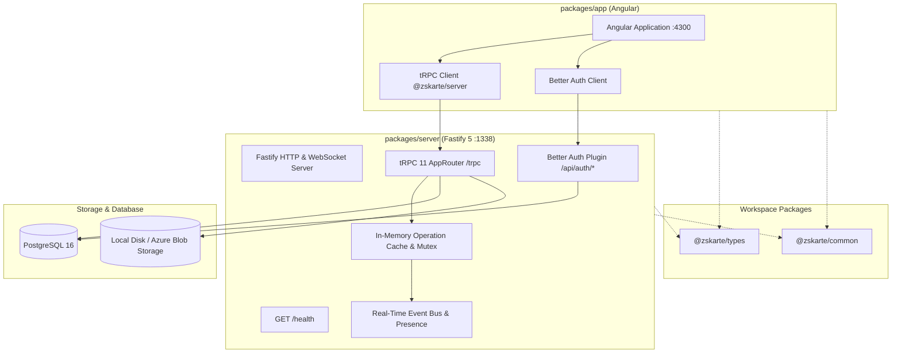

# Zivilschutz-Karte Developer Guide

This guide documents the architecture, development workflows, and extension patterns for the Zivilschutz-Karte platform.

---

## Architecture Overview

Zivilschutz-Karte uses a modern TypeScript monorepo with an Angular frontend and a Fastify + tRPC + Drizzle ORM + Better Auth backend.



### Key Architectural Concepts

- **Fastify 5 Server**: High-throughput HTTP and WebSocket server hosting tRPC endpoints (`/trpc`), Better Auth routes (`/api/auth/*`), static assets (`/uploads/` in local mode), and health checks (`/health`).
- **End-to-End Type Safety with tRPC 11**: Client and server communicate via strongly-typed queries, mutations, and WebSocket subscriptions using `@trpc/server` and `@trpc/client`.
- **Drizzle ORM & PostgreSQL**: Relational data modeling using TypeScript schemas in `src/db/schema.ts` and `src/modules/*/schema.ts`. Automated migration management via Drizzle Kit.
- **Better Auth & Role Permissions**: Authentication handling via Better Auth with session cookies, username plugin, custom session enrichment (`customSession`), and a dynamic role permission matrix stored in PostgreSQL and cached in memory.
- **Single-Instance In-Memory Operation Caching**: Real-time map collaboration uses an in-memory operation cache (`OperationCache`) with a queue mutex (`QueueMutex`), Immer patch application, cryptographic changeset signing, and tRPC WebSocket subscriptions (`onChangeset`, `onConnections`).

---

## Workspace Structure

```
zskarte/
├── packages/
│   ├── app/          # Angular frontend client (port 4300)
│   ├── common/       # Shared business logic, changeset verification, drawing helpers
│   ├── types/        # Shared TypeScript interfaces, enums, and types
│   └── server/       # Fastify backend, tRPC routers, Drizzle ORM, Better Auth (port 1338)
├── .azure/k8s/       # Kubernetes manifests (deployment, service, ingress, server-envs)
├── .github/workflows/# CI/CD workflows (pr.yml, deploy-main.yml, deploy-test.yml)
└── scripts/          # Workspace automation scripts
```

---

## Adding a New Domain Module

Backend features are organized into modular domains under `packages/server/src/modules/<module-name>/`. Each module consists of four standard layers:

```
src/modules/<module-name>/
├── schema.ts      # Drizzle table definitions, enums, and column types
├── repository.ts  # Database access layer with tenant scoping
├── service.ts     # Business logic, authorization checks, and data transformations
└── router.ts      # tRPC router exposing procedures with Zod validation
```

### 1. Define the Database Schema (`schema.ts`)

Define table columns using Drizzle ORM and shared column helpers (`documentId`, `timestamps` from `../../db/columns.js`):

```typescript
// packages/server/src/modules/example/schema.ts
import { pgTable, text, uuid, boolean } from 'drizzle-orm/pg-core';
import { documentId, timestamps } from '../../db/columns.js';
import { organizations } from '../organization/schema.js';

export const examples = pgTable('examples', {
  documentId: documentId(),
  title: text('title').notNull(),
  description: text('description'),
  active: boolean('active').notNull().default(true),
  organizationId: uuid('organization_id')
    .notNull()
    .references(() => organizations.documentId, { onDelete: 'cascade' }),
  ...timestamps,
});

export type ExampleRow = typeof examples.$inferSelect;
export type ExampleInsert = typeof examples.$inferInsert;
```

Export your table in `packages/server/src/db/schema.ts` so that Drizzle Kit picks it up during migration generation.

### 2. Implement the Repository Layer (`repository.ts`)

Keep the repository layer pure and scoped to the tenant (`organizationId`):

```typescript
// packages/server/src/modules/example/repository.ts
import { and, eq } from 'drizzle-orm';
import type { Database } from '../../db/client.js';
import { examples, type ExampleInsert, type ExampleRow } from './schema.js';

export interface ExampleScope {
  organizationId: string;
}

export const list = (db: Database, scope: ExampleScope): Promise<ExampleRow[]> => {
  return db
    .select()
    .from(examples)
    .where(eq(examples.organizationId, scope.organizationId));
};

export const findById = async (
  db: Database,
  scope: ExampleScope,
  documentId: string,
): Promise<ExampleRow | undefined> => {
  const [row] = await db
    .select()
    .from(examples)
    .where(and(eq(examples.documentId, documentId), eq(examples.organizationId, scope.organizationId)))
    .limit(1);
  return row;
};

export const insert = async (
  db: Database,
  scope: ExampleScope,
  values: Omit<ExampleInsert, 'documentId' | 'organizationId' | 'createdAt' | 'updatedAt'>,
): Promise<ExampleRow> => {
  const [row] = await db
    .insert(examples)
    .values({ ...values, organizationId: scope.organizationId })
    .returning();
  if (!row) throw new Error('Failed to insert example');
  return row;
};
```

### 3. Implement the Service Layer (`service.ts`)

The service layer handles context unpacking, validation rules, and error handling:

```typescript
// packages/server/src/modules/example/service.ts
import { TRPCError } from '@trpc/server';
import type { Context, Scope } from '../../trpc/context.js';
import * as repository from './repository.js';

type ScopedContext = Context & { scope: Scope };
const forbidden = new TRPCError({ code: 'FORBIDDEN', message: 'This action is forbidden.' });

const scopeFor = (ctx: ScopedContext): repository.ExampleScope => ({
  organizationId: ctx.scope.organizationId,
});

export const list = (ctx: ScopedContext) => repository.list(ctx.db, scopeFor(ctx));

export const byId = async (ctx: ScopedContext, documentId: string) => {
  const row = await repository.findById(ctx.db, scopeFor(ctx), documentId);
  if (!row) throw forbidden;
  return row;
};

export const create = async (
  ctx: ScopedContext,
  data: { title: string; description?: string | null },
) => {
  return repository.insert(ctx.db, scopeFor(ctx), data);
};
```

### 4. Implement the tRPC Router (`router.ts`)

Build the router with procedure middleware (`orgProcedure`, `operationProcedure`, `requirePermission`, `rejectShareSession`):

```typescript
// packages/server/src/modules/example/router.ts
import { z } from 'zod';
import { orgProcedure, rejectShareSession, requirePermission } from '../../trpc/procedures.js';
import { router } from '../../trpc/trpc.js';
import * as service from './service.js';

export const exampleRouter = router({
  list: orgProcedure
    .use(requirePermission('example.list' as any))
    .query(({ ctx }) => service.list(ctx)),

  byId: orgProcedure
    .use(requirePermission('example.byId' as any))
    .input(z.object({ documentId: z.uuid() }))
    .query(({ ctx, input }) => service.byId(ctx, input.documentId)),

  create: orgProcedure
    .use(rejectShareSession)
    .use(requirePermission('example.create' as any))
    .input(
      z.object({
        title: z.string().min(1).max(255),
        description: z.string().nullable().optional(),
      }),
    )
    .mutation(({ ctx, input }) => service.create(ctx, input)),
});
```

### 5. Register in `appRouter`

Add your feature router to `packages/server/src/trpc/router.ts`:

```typescript
import { exampleRouter } from '../modules/example/router.js';

export const appRouter = router({
  // ...other routers
  example: exampleRouter,
});
```

---

## Database Migrations & Seeding Workflow

Database migrations are managed using **Drizzle ORM** and **Drizzle Kit**.

### 1. Generating Migrations
When you add or modify schema definitions in `src/modules/*/schema.ts` (and exported via `src/db/schema.ts`), generate a new migration:

```bash
npm run db:generate
```
This generates numbered SQL migration scripts and snapshot files inside `packages/server/drizzle/`.

### 2. Applying Migrations
Apply pending migrations against your PostgreSQL instance:

```bash
npm run db:migrate
```
*Note: In production containers, migrations execute automatically on boot if `RUN_MIGRATIONS_ON_BOOT=true` is set.*

### 3. Seeding Database
Seed default organizations, initial administrative and test users, default role permissions, and map style assets:

```bash
npm run db:seed
```

#### Default Seed Accounts
| Username | Role | Default Password | Description |
|---|---|---|---|
| `zso_admin` | `admin` | `supersecret123` | System administrator with full access to all organizations and operations |
| `operation_all` | `organization` | `supersecret123` | Standard organization member (ZSO Development) |
| `zso_guest` | `guest` | `zsogast` | Restricted guest user (ZSO Gast) |
| `operation_read` | `operationread` | `supersecret123` | Read-only access to scoped operation |
| `operation_write` | `operationwrite` | `supersecret123` | Read/write access to scoped operation |

---

## Authentication & Authorization Model

### Better Auth Integration
Authentication is powered by **Better Auth** (`packages/server/src/auth/auth.ts`):
- Endpoints are mounted on Fastify at `/api/auth/*`.
- Client communicates via session cookies (`credentials: 'include'`).
- The `customSession` plugin enriches every active session with `zsRole`, `organizationId`, and optional `operationId`.
- The `shareAccess` custom plugin allows guest users to authenticate via tokenized share links without full account registration.

### Roles & Permission Matrix
User access is governed by roles (`ROLES` in `src/auth/roles.ts`):
- `admin`: Superuser with bypass for all permissions.
- `organization`: Full organization management, operation creation, and map editing.
- `guest`: Restricted exploration role.
- `operationwrite`: Read/write access restricted to a specific operation.
- `operationread`: Read-only access restricted to a specific operation.
- `public`: Unauthenticated users.

Permissions are defined in `src/auth/permissions.ts` (`PERMISSION_KEYS`) and mapped in the `role_permissions` database table. Permissions are cached in-memory with an LRU cache (`permissionCache`) for low latency.

### Procedure Middleware Builders
tRPC procedures enforce authorization via composable middleware in `src/trpc/procedures.ts`:
- `publicProcedure`: No authentication required (e.g. `/health`, version info).
- `sessionProcedure`: Requires an authenticated session.
- `adminProcedure`: Requires `zsRole === 'admin'`.
- `orgProcedure`: Requires valid organization scoping (`ctx.scope.organizationId`).
- `operationProcedure`: Verifies the operation exists, matches organization scope, and checks if archived before mutation.
- `requirePermission('permission.name')`: Verifies the caller's role has the designated permission.
- `rejectShareSession`: Prohibits share link session tokens from accessing administrative or out-of-scope actions.

---

## Real-Time Collaboration & Operation Cache

### Single-Instance Architecture
Zivilschutz-Karte runs a single backend instance per environment. Real-time map changesets are processed entirely in memory:
1. **In-Memory Operation Cache (`OperationCache`)**: Tracks active map state (`ZsMapState`), changesets, and cryptographic signatures.
2. **Queue Mutex (`QueueMutex`)**: Serializes concurrent changeset submissions per operation to guarantee atomic order.
3. **Immer Patch Verification**: Validates changeset consistency, applies patches to the in-memory map state, and writes the state to PostgreSQL.
4. **Changeset Signing**: Changesets are signed with an active server private key (RSA or Ed25519/EdDSA) to ensure provenance and integrity.
5. **WebSocket Real-Time Subscriptions**:
   - `operation.onChangeset`: Streams new incoming changesets to connected clients on the same operation.
   - `operation.onConnections`: Tracks and broadcasts active user presence and cursor/marker identifiers.

---

## Offline Map Layer Generation CLI

Zivilschutz-Karte includes a built-in CLI tool to generate pre-packaged offline map layers from spatial data:

```bash
npm run maplayer:generate -- --help
```

The CLI reads spatial configuration, converts vector data (GeoJSON, Shapefile, CSV), applies styling, and packages offline-ready map bundles stored locally or uploaded to Azure Blob Storage.

---

## Testing Strategy: Local vs. CI

To maximize development velocity and optimize resource usage, testing responsibilities are separated:

### Local Verification (Fast & Deterministic)
Run fast static checks and unit/integration test suites locally:
```bash
# 1. Workspace linting
npm run lint

# 2. TypeScript compilation across workspace
npm run build:types && npm run build:common && npm run build:server

# 3. Backend unit & integration tests
npm --prefix packages/server run test

# 4. Backend permission matrix test suite
npm --prefix packages/server run test:permissions

# 5. Frontend unit & component tests
npm --prefix packages/app test
```

### Continuous Integration (CI/CD)
- **Pull Requests (`.github/workflows/pr.yml`)**: Executes workspace linting, compilation, server tests, permissions tests, and automated **Playwright E2E browser tests** in headless Linux runners with browser binary caching.
- **Deployments (`deploy-test.yml` / `deploy-main.yml`)**: Multi-stage container builds pushed to Docker Hub and rolled out to Kubernetes with `/health` verification.