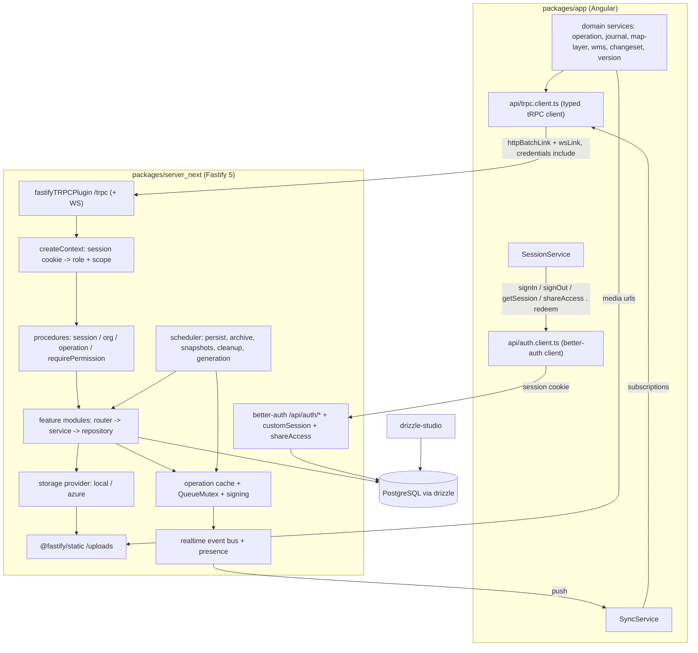

# Requirements

### Overview & Goals

Replace the Strapi 5 backend (`packages/server`) with `` built on **Fastify 5 + tRPC 11 + Drizzle ORM + better-auth**,
with **drizzle-studio** as the admin GUI.

Goals:

- **All domain traffic goes through tRPC** — queries, mutations *and* subscriptions. socket.io and the Strapi REST
  `/api/...` surface disappear.
- **Authentication *and* authorization are entirely better-auth's domain.** There is **no `auth.*` tRPC router**.
  Sign-in, sign-out, session retrieval, refresh and share-token redemption are all invoked through the official
  **better-auth client** (`createAuthClient`) against `/api/auth/*`; the enriched session payload (organization, role,
  operation) comes from better-auth's `customSession` plugin, not from a tRPC procedure.
- **Drizzle owns the schema** — greenfield tables, real FKs, real unique constraints, SQL migrations under version
  control.
- **No Strapi admin panel** — drizzle-studio plus seed/CLI scripts.
- **Full functional parity**, verified against the existing Angular app and the Playwright e2e suite.

### New delivery rule (this revision)

**Every delivery step must leave the Angular app calling the new backend for the surface that step ported.** A step is
not done when the tRPC procedures exist — it is done when the corresponding call sites in `packages/app` no longer talk
to Strapi REST (or socket.io) and the app typecheck is clean. Concretely, each step ends with:

1. the ported procedures / better-auth endpoints implemented and unit-tested in ``,
2. the matching `packages/app` services and components rewritten onto `trpcClient.<router>.<procedure>` or
   `authClient.*`,
3. `npx tsc -p tsconfig.app.json --noEmit` clean in `packages/app` (the agreed frontend gate),
4. the obsolete REST helper code for that surface deleted.

This replaces the previous shape of the plan, where the entire client cut-over was deferred to one final big-bang step.

### Scope

#### In Scope

- New package `` (`@zskarte/server-next`) replacing `@zskarte/server`.
- Domain modules: operations + map-state changesets, journal entries, accesses/share links, organizations, map layers,
  WMS sources, map snapshots, signing keys, map-layer generation config, version, proxy.
- Real-time push over tRPC WebSocket subscriptions (changesets, journal updates, presence/`currentLocation`).
- better-auth with username/password (`username` plugin, matching today's `zso_*` identifiers), **cookie-based
  sessions**, `customSession` for the session payload, an explicit role→permission matrix ported from
  `packages/server/config/sync/*.json`, and a `shareAccess` plugin issuing operation-scoped sessions — plus its
  **client** plugin so `authClient.shareAccess.redeem()` and the extra session fields are typed end-to-end.
- File storage replacing Strapi's upload plugin: `files` table + local-disk and Azure Blob providers + `/uploads/*`
  static serving.
- Port of the map-layer generation pipeline (`packages/server/src/state/maplayer.ts`, ~1350 lines) and its worker
  thread.
- Scheduled jobs: 15 s map-state persistence, hourly auto-archive + expired-token cleanup, 5 min snapshots, nightly
  guest-operation purge, semi-monthly map-layer regeneration.
- Angular changes, delivered **incrementally per step**: a dedicated `packages/app/src/app/api/trpc.client.ts`,
  `session.service.ts` fully on `authClient`, `sync.service.ts` on tRPC subscriptions, and all ~15 consuming services
  retargeted; `api.service.ts` and `transformer.ts` deleted once the last REST caller is gone.
- Root wiring: workspace scripts, `Dockerfile`, `docker-compose.yml`, developer docs; removal of `packages/server`.

#### Out of Scope

- Migrating existing production data (greenfield schema + fresh seed).
- Any change to map rendering, drawing, PDF/Excel export or offline (Dexie) behaviour beyond the transport swap.
- New product features. Behaviour is frozen at today's semantics except the explicit improvements noted (DB-enforced
  journal numbers, type-enforced scoping, proxy host allowlist).
- OAuth/social login, 2FA, email verification.
- A custom admin web UI.

### User Stories

- As an **organization user**, I log in with username/password and see only my organization's operations, journal
  entries, layers and WMS sources — exactly as before.
- As a **share-link recipient**, I redeem a 6-digit or 32-char token and get read/write access limited to one operation.
- As a **user drawing on the map**, my changeset is accepted, signed, applied to the authoritative map state and pushed
  to every other client on that operation within today's latency budget.
- As a **journal user**, my entry receives a unique, gap-free message number per operation even under concurrency.
- As a **developer**, after each delivery step I can pull, run `npm run start`, and the app still works for everything
  ported so far — no step leaves the app half-wired against a backend that is gone.
- As an **operator**, I trigger map-layer regeneration with a CLI command and get the same generated layers and styles.

### Functional Requirements

1. **Endpoint parity.** Every route in `packages/server/src/api/*/routes/*` has an equivalent tRPC procedure — except
   the authentication routes, which map onto better-auth endpoints (see *App Migration Map*). The `identifier` and
   `operationId` HTTP headers become explicit, validated procedure inputs.
2. **Authentication and authorization run on better-auth only.** Sign-in, sign-out, session retrieval/refresh and
   share-token redemption go through `authClient` (`signIn.username`, `signOut`, `getSession`, `shareAccess.redeem`).
   `src/auth/router.ts` and the `auth` entry in the root tRPC router are **removed**.
3. **Session payload parity with `/api/users/me` via `customSession`.** `authClient.getSession()` returns
   `{ user, session, organization, operationId, zsRole }`, where `organization` is the populated projection including
   `wms_sources` / `map_layer_favorites` as **uuid** arrays. One call replaces both today's `getSession()` +
   `trpc.auth.me` pair.
4. **Cookie-based sessions.** The browser authenticates with better-auth's session cookie; the tRPC links send
   `credentials: 'include'`. CORS must allow credentials and `trustedOrigins` must match the app origin. No bearer token
   is stored in the app or in Dexie.
5. **Response-shape compatibility.** Paginated list procedures return
   `{ data, meta: { pagination: { page, pageSize, pageCount, total } } }` so `StrapiApiResponseList<T>` consumers keep
   working.
6. **Single identifier.** The greenfield schema has **no numeric `id`**; `document_id uuid` is the only handle.
   Remaining `id` reads in the app (`map-layer.service.ts` `fullId`, `media_source` from `mapLayer.source.id`) are
   retargeted to `documentId` in the step that migrates those services.
7. **Date fidelity.** superjson stays the tRPC transformer so `Date` round-trips; better-auth keeps its own JSON
   encoding and its date fields are normalized at the `SessionService` boundary.
8. **Authorization parity.** The five roles (`organization`, `guest`, `operationread`, `operationwrite`, `public`) keep
   exactly the permission sets defined in `config/sync/*.json`. Archived operations reject all mutations except
   `unarchive` / `shadowDelete` / read.
9. **Scoping is not client-controllable.** No procedure accepts raw filters; organization/operation predicates are
   injected server-side.
10. **Changeset integrity.** Per-operation serialization via the ported `QueueMutex` (15 s max wait →
    `TOO_MANY_REQUESTS`), duplicate-submit detection, `verifyChangesetConsistency`, inverse-patch verification,
    ed25519/RSA signing, author-IP capture.
11. **Real-time.** Subscribers on an operation receive `{ changeset, sign }`, journal changes and the presence list; the
    originating `identifier` is excluded, as today.
12. **Share-link lifecycle.** Long tokens (32 hex chars) persist; short tokens (6 digits) expire after 15 minutes and
    are consumed on redemption; expired rows are purged hourly. Redemption is a better-auth endpoint; *issuing*/revoking
    stays on the tRPC `access` router.
13. **Version handshake.** `version.compatibility` compares major versions and reports `backendVersion`.
14. **Generated map layers.** The pipeline produces the same `map_layers`, files and styles, driven by the same config
    row, on schedule and on demand.
15. **Per-step client parity.** See *New delivery rule*: no step may leave `packages/app` calling a Strapi endpoint
    whose replacement it just shipped.

### Non-Functional Requirements

- **Single-instance backend.** Authoritative map state lives in memory and is flushed every 15 s; horizontal scaling is
  unsupported and documented.
- **Node ≥ 22.14**, TypeScript, ESM, Fastify 5, Postgres 16+ (dev container `postgresql-zskarte`, host port 55432,
  database `zskarte_next`).
- **Graceful shutdown** flushes the operation cache and aborts queued changesets.
- **Security:** CORS restricted to configured origins with credentials, better-auth rate limiting, `useSecureCookies` in
  production, zod-validated secrets, private keys and access tokens never serialized to clients, proxy host allowlist.
- **Tooling:** biome lint, vitest in `/test`, `drizzle-kit generate`/`migrate`, `tsc --noEmit` as the app-side gate.

# Technical Design

### Current Implementation

#### Backend — what already exists in ``

| Area            | State                                                                                                                                                                                                                                                                                                                                                                                                         |
|-----------------|---------------------------------------------------------------------------------------------------------------------------------------------------------------------------------------------------------------------------------------------------------------------------------------------------------------------------------------------------------------------------------------------------------------|
| Runtime         | `src/server.ts` (Fastify 5, CORS, `@fastify/static`, `fastifyTRPCPlugin` at `/trpc`, `responseMeta` emitting `cache-control: max-age=86400` for non-batched `mapSnapshot.byId`), `src/index.ts`, `src/env.ts` (incl. `PROXY_ALLOWED_HOSTS`)                                                                                                                                                                   |
| Schema          | Full greenfield drizzle schema in `src/modules/*/schema.ts` — **`document_id uuid` primary keys only, no numeric `id`**                                                                                                                                                                                                                                                                                       |
| Auth            | better-auth at `/api/auth/*` (`src/auth/auth.ts`, `handler.ts`), **cookie-based**, `username()` plugin, `share-access-plugin.ts`, `permissions.ts` + `roles.ts` (the role matrix is final)                                                                                                                                                                                                                    |
| tRPC            | `src/trpc/{trpc,context,procedures,router}.ts` — `publicProcedure`, `sessionProcedure`, `orgProcedure`, `operationProcedure`, `requirePermission`, `rejectShareSession`, `assertCreateIdentifiersNotForced`                                                                                                                                                                                                   |
| Modules done    | `organization` (`forLogin`, `current`, `updateSettings`, `updateLayerSettings`, `updateJournalEntryTemplate`), `map-layer` and `wms-source` (`list`/`byId`/`create`/`update`/`delete`), `map-snapshot` (`list` with `fields` projection + pagination meta, `byId`), `signing-key` (`byKeyId`) + `src/lib/signing.ts`, `misc` (`version.get`, `version.compatibility`, `proxy.fetch`), `src/lib/pagination.ts` |
| Modules pending | `operation` (+ cache, changesets, realtime), `journal`, `access`, `file` storage, `map-layer-generation`, `jobs/scheduler.ts` — only their `schema.ts` exists                                                                                                                                                                                                                                                 |
| Tests           | 12 vitest files, 117 tests, all green; `tsc --noEmit` clean                                                                                                                                                                                                                                                                                                                                                   |

#### Angular app — what is already migrated

| Call site                                                 | State                                                                                                                                                                                                                                            |
|-----------------------------------------------------------|--------------------------------------------------------------------------------------------------------------------------------------------------------------------------------------------------------------------------------------------------|
| `session/login/login.component.ts`                        | ✅ `session.trpcClient.organization.forLogin.query()`                                                                                                                                                                                            |
| `session/session.service.ts` `login()`                    | ✅ `authClient.signIn.username(...)`                                                                                                                                                                                                             |
| `session/session.service.ts` `loadAuthenticatedSession()` | ⚠️ `authClient.getSession()` **plus** `trpcClient.auth.me.query()` — two calls, and the tRPC one must go                                                                                                                                         |
| `session/session.service.ts` `shareLogin()`               | ⚠️ raw `fetch('/api/auth/share-access/redeem')` — untyped, no client plugin                                                                                                                                                                      |
| tRPC client                                               | ⚠️ created inline in `session.service.ts` (`createCookieTRPCClient`), exposed as `session.trpcClient`                                                                                                                                            |
| Everything else                                           | ❌ still `ApiService` → `environment.apiUrl` (Strapi, port 1337): org settings, journal, operations, changesets, map layers, WMS sources, snapshots, signing key, version, share-token generation/revocation, and `sync.service.ts` on socket.io |

**Consequence:** because login now issues a *better-auth* cookie and `ApiService` still points at Strapi with a bearer
header, every not-yet-migrated REST call is effectively dead. The app is only usable up to organization selection. This
is exactly why the client migration must be pulled into each step instead of being deferred.

### Key Decisions

1. **tRPC for domain traffic, `ApiService`-shaped call sites** (unchanged). Each call site swaps
   `this._api.get('/api/...')` for `this._trpc.<router>.<procedure>.query(...)`.
2. **Authentication *and* authorization are 100 % better-auth — the `auth.*` tRPC router is deleted (revised).** The
   last remaining procedure, `auth.me`, moves into better-auth's `customSession` plugin
   (`better-auth/plugins/custom-session`, available in the installed 1.7.2), reusing
   `src/modules/organization/repository.ts::getOrganization`. The app adds `customSessionClient<typeof auth>()` and
   `shareAccessClient()` to `createAuthClient`, so `authClient.getSession()` is the single session read and
   `authClient.shareAccess.redeem({ accessToken })` replaces the raw `fetch`. Rationale: one owner for identity, one
   typed client, no duplicated projection (the projection currently exists twice — inline in `src/auth/router.ts` and in
   `modules/organization/repository.ts`).
3. **Cookie sessions, not bearer (revised).** Established by commit `75f0bec5`. The tRPC links use
   `fetch(url, { ...options, credentials: 'include' })`; WS subscriptions will authenticate from the cookie on the
   upgrade request rather than `connectionParams`, with `connectionParams` kept only as a fallback for non-browser
   clients.
4. **Login stays username-based** via better-auth's `username` plugin (`zso_*` identifiers, synthetic
   `<username>@zskarte.local` emails).
5. **Greenfield schema, uuid-only identity (revised).** `document_id uuid` is the sole primary key; there is no
   `id serial`. `organization.wms_sources` / `map_layer_favorites` are uuid arrays. The app's leftover numeric-`id`reads
   are retargeted as part of the step that migrates the owning service.
6. **Real-time over tRPC WebSocket subscriptions.** `@fastify/websocket` registered **before** `fastifyTRPCPlugin`,
   `useWSS: true`, presence derived from subscription lifecycle.
7. **better-auth for identity; permissions in code.** `src/auth/permissions.ts` is the literal port of
   `config/sync/*.json` and is **final** — no new keys.
8. **Feature-module structure.** `src/modules/<feature>/{router,service,repository,schema}.ts`; `repository.ts`functions
   take an explicit `scope: { organizationId, operationId? }` so a query that forgets tenant scoping does not compile.
9. **Share links are better-auth sessions**, issued/revoked over the tRPC `access` router, redeemed over better-auth.
10. **Journal numbering moves into the database** — `unique (operation_id, organization_id, message_number)` plus a
    bounded retry.
11. **No admin HTTP surface** — `npm run maplayer:generate` CLI instead of the admin-JWT endpoint.
12. **No client upload endpoints** — the app never sends `FormData`; file writes come from the generation pipeline and
    seed/CLI scripts.
13. **The app's tRPC client lives in `packages/app/src/app/api/trpc.client.ts` (new).** A standalone module exporting a
    single typed `createTRPCClient<AppRouter>` instance (superjson, `httpBatchLink` + `splitLink`→`wsLink`,
    `credentials: 'include'`), injected directly by each service. This removes the current `session.trpcClient` detour,
    which would otherwise force unrelated services (`journal`, `map-layer`, `wms`, `changeset`, `sync`) to depend on
    `SessionService` and would deepen the existing `SessionService` ⇄ `ApiService` ⇄ `OperationService`
    circular-dependency workarounds.
14. **Per-step client parity with a typecheck gate (new).** Each step migrates its own call sites and is gated on
    `npx tsc -p tsconfig.app.json --noEmit` in `packages/app` (plus the existing app vitest specs where they cover the
    touched service). Browser/Playwright verification is deliberately **not** a per-step gate; the full Playwright suite
    runs once in the final step, when the backend surface is complete.

### Proposed Changes

#### Server — auth consolidation (first)

```ts
// src/auth/auth.ts — plugin list gains customSession, router.ts disappears
plugins: [
    username(),
    shareAccess({ /* redeem + refresh */}),
    customSession(async ({user, session}) => ({
        user,
        session,
        zsRole: user.zsRole,
        operationId: session.operationId ?? null,
        organization: await getOrganization(db, {organizationId: session.organizationId ?? user.organizationId}),
    })),
]
```

- `src/auth/router.ts` is **deleted**; `auth: authRouter` is removed from `src/trpc/router.ts`.
- `getOrganization` keeps exactly its current projection (organization columns + `logo` from `files` + `users` +
  `operations` + uuid `wms_sources` / `map_layer_favorites`, cast to `IZsMapOrganization`) and lives only in
  `src/modules/organization/repository.ts`.
- Note the better-auth semantics: `customSession` fields are never cookie-cached and are always resolved server-side, so
  organization edits appear on the next `getSession()`.

#### Server — remaining modules

Unchanged from the previous revision: `modules/operation/{cache,router,service,repository}.ts` (near-literal port of
`state/operation.ts` + `lib/queue-mutex.ts`), `realtime/{event-bus,presence}.ts`, `modules/journal/**` with DB-enforced
numbering, `modules/access/**` for issuing/revoking share links, `modules/file/storage.ts` (`StorageProvider` with
local + Azure providers), `modules/map-layer-generation/**` (service + worker + CLI), `jobs/scheduler.ts`.

#### App — transport layer

```ts
// packages/app/src/app/api/trpc.client.ts (new)
export const trpc = createTRPCClient<AppRouter>({
    links: [
        splitLink({
            condition: (op) => op.type === 'subscription',
            true: wsLink({
                client: createWSClient({url: `${environment.apiUrlNext.replace(/^http/, 'ws')}/trpc`}),
                transformer: superjson
            }),
            false: httpBatchLink({
                url: `${environment.apiUrlNext}/trpc`,
                transformer: superjson,
                fetch: (url, options) => fetch(url, {...options, credentials: 'include'}),
            }),
        }),
    ],
});
```

```ts
// packages/app/src/app/api/auth.client.ts (new — extracted from session.service.ts)
export const authClient = createAuthClient({
    baseURL: environment.apiUrlNext,
    fetchOptions: {credentials: 'include'},
    plugins: [usernameClient(), customSessionClient<Auth>(), shareAccessClient()],
});
```

`AppRouter` and the `shareAccessClient` plugin are imported with `import type` / from a types-only entrypoint of
`@zskarte/server-next` (today `session.service.ts` reaches into `@zskarte/server-next/dist/trpc/router`, which is
replaced by a stable export path so the Angular build never pulls server code).

`SessionService` keeps its public API (`login`, `shareLogin`, `logout`, `observeAuthenticated`,`observeOrganization`, …)
and loses `getToken()` once no REST caller remains.

### Components

| Component                                                                                  | Change                                                                                                                                                         | Step |
|--------------------------------------------------------------------------------------------|----------------------------------------------------------------------------------------------------------------------------------------------------------------|------|
| `src/auth/auth.ts`                                                                         | `customSession` plugin added                                                                                                                                   | 1    |
| `src/auth/router.ts`, `auth` key in `src/trpc/router.ts`                                   | **Deleted**                                                                                                                                                    | 1    |
| `packages/app/src/app/api/auth.client.ts`                                                  | **New** — extracted from `session.service.ts`, gains `customSessionClient` + `shareAccessClient`                                                               | 1    |
| `packages/app/src/app/api/trpc.client.ts`                                                  | **New** — the single typed tRPC client                                                                                                                         | 2    |
| `session.service.ts`                                                                       | `loadAuthenticatedSession` → one `getSession()`; `shareLogin` → `authClient.shareAccess.redeem`; org settings → `organization.update*`; token handling dropped | 1–2  |
| `map-layer.service.ts`, `map-layer/wms/wms.service.ts`                                     | REST → `mapLayer.*` / `wmsSource.*`; numeric `id` reads retargeted to `documentId`                                                                             | 2    |
| `sidebar-history.component.ts`, `change-detail.component.ts`                               | REST → `mapSnapshot.list` / `mapSnapshot.byId`; `snapshotApiPath` removed                                                                                      | 2    |
| `changeset/signing.service.ts`, `version/version.service.ts`                               | REST → `signingKey.byKeyId`, `version.*`                                                                                                                       | 2    |
| `session/operations/operation.service.ts`                                                  | REST → `operation.*`                                                                                                                                           | 3    |
| `changeset/changeset.service.ts` (+ `.spec.ts`)                                            | REST → `operation.submitChangeset`                                                                                                                             | 3    |
| `sync/sync.service.ts`                                                                     | socket.io → `operation.onChangeset` / `onConnections` / `journal.onChanged`; `socket.io-client` dropped                                                        | 4    |
| `journal/journal.service.ts`                                                               | REST → `journal.*`                                                                                                                                             | 5    |
| `revoke-share-dialog.component.ts`, share generation in `session.service.ts`               | REST → `access.*`                                                                                                                                              | 5    |
| `api/api.service.ts`, `api/transformer.ts`                                                 | **Deleted** when the last REST caller is gone                                                                                                                  | 6–7  |
| `helper/strapi-utils.ts`                                                                   | Kept, renamed `media-utils.ts`; `mapInternalUrl` points at `apiUrl`                                                                                            | 6    |
| `packages/server`                                                                          | **Deleted**                                                                                                                                                    | 7    |
| Root `package.json`, `Dockerfile`, `docker-compose.yml`, `DEVELOPER_GUIDE.md`, `README.md` | Retargeted at `server`                                                                                                                                         | 7    |

### Architecture Diagram



### Risks

| Risk                                                                                                                                   | Mitigation                                                                                                                                                                                                                       |
|----------------------------------------------------------------------------------------------------------------------------------------|----------------------------------------------------------------------------------------------------------------------------------------------------------------------------------------------------------------------------------|
| **The app is currently broken beyond login** (better-auth cookie + `ApiService` still pointed at Strapi).                              | This is the driver for the per-step client migration; step 2 restores the largest broken slice (layers, sources, snapshots, org settings, version, signing key) immediately after the already-shipped backend modules.           |
| **`customSession` payload drift** — the app reads `zsRole`, `operationId`, `organization.logo.url`, `organization.wms_sources`.        | Reuse `modules/organization/repository.ts::getOrganization` verbatim; add a contract test asserting the `getSession()` payload keys against `IZsMapOrganization` and the fields `session.service.ts` consumes.                   |
| **Cookie + CORS + WS handshake** — credentials must be allowed, `trustedOrigins` must match, and the WS upgrade must carry the cookie. | Keep `credentials: 'include'` on both clients, align `TRUSTED_ORIGINS` with the CORS origins, and cover with an integration test that signs in and then calls a protected procedure over HTTP *and* WS.                          |
| **Authorization regression** — `accessControl.ts` encodes years of edge cases.                                                         | The matrix in `src/auth/permissions.ts` is final and already covered by `test/permissions.test.ts`; every new module reuses `requirePermission` and answers `FORBIDDEN`/`This action is forbidden.` for missing-or-foreign rows. |
| **Changeset correctness.**                                                                                                             | Port `state/operation.ts` and `queue-mutex.ts` with minimal edits; reuse `@zskarte/common` verification helpers; add concurrency tests.                                                                                          |
| **Presence semantics differ** between socket.io and tRPC subscriptions.                                                                | Derive presence purely from subscription start/abort; keep `keepAlive`; validate with two sessions and a forced network drop in step 4.                                                                                          |
| **Error-shape mismatch** — call sites branch on `{ status, message }` and `HttpErrorResponse`.                                         | Map `TRPCClientError` to that shape in a small helper next to `trpc.client.ts`; map better-auth's `{ error: { code, status, message } }` in `SessionService`, replacing today's string matching.                                 |
| **Angular build pulling server code** through the `AppRouter` type import.                                                             | Export `AppRouter` from a types-only entrypoint and import it with `import type` only; verify bundle size after step 2.                                                                                                          |
| **Duplicated `getOrganization`** (inline in `src/auth/router.ts` and in `modules/organization/repository.ts`) after the latest pull.   | Step 1 deletes the inline copy together with the router.                                                                                                                                                                         |
| **Generation pipeline port** is the largest single chunk.                                                                              | Do it late, behind `MAPLAYER_GENERATION_ENABLED`; compare the generated layer/file inventory against a Strapi baseline before deleting `packages/server`.                                                                        |

# App Migration Map

Every row states the Strapi endpoint, its replacement, the Angular call site that must change, and the step that does
it. Rows marked ✅ are already migrated.

### Auth & session — better-auth only (no `auth.*` tRPC router)

| Today                             | New                                                                      | App call site                                                                                                          | Step     |
|-----------------------------------|--------------------------------------------------------------------------|------------------------------------------------------------------------------------------------------------------------|----------|
| `POST /api/auth/local`            | `POST /api/auth/sign-in/username`                                        | ✅ `session.service.ts` → `authClient.signIn.username`                                                                 | 2 (done) |
| `GET /api/users/me`               | `GET /api/auth/get-session` enriched by `customSession`                  | `session.service.ts::loadAuthenticatedSession` — drop `trpcClient.auth.me.query()`, keep one `authClient.getSession()` | **1**    |
| `GET /api/accesses/auth/refresh`  | rolling refresh on `get-session` + `POST /api/auth/share-access/refresh` | `session.service.ts` refresh path → `authClient.getSession()` / `authClient.shareAccess.refresh()`                     | **1**    |
| `POST /api/accesses/auth/token`   | `POST /api/auth/share-access/redeem`                                     | `session.service.ts::shareLogin` — raw `fetch` → `authClient.shareAccess.redeem({ accessToken })`                      | **1**    |
| *(app just dropped the JWT)*      | `POST /api/auth/sign-out`                                                | `session.service.ts::logout`                                                                                           | **1**    |
| `GET /api/organizations/forlogin` | `organization.forLogin`                                                  | ✅ `login.component.ts`                                                                                                | 3 (done) |

### Organizations, layers, sources, snapshots, misc — backend already shipped

| Today                                               | New                                                         | App call site                                                                                          | Step  |
|-----------------------------------------------------|-------------------------------------------------------------|--------------------------------------------------------------------------------------------------------|-------|
| `PUT /api/organizations/:id/settings`               | `organization.updateSettings`                               | `session.service.ts` (~l. 367)                                                                         | **2** |
| `PUT /api/organizations/:id/layer-settings`         | `organization.updateLayerSettings` (uuid allowlist)         | `session.service.ts` (~l. 386)                                                                         | **2** |
| `PUT /api/organizations/:id/journal-entry-template` | `organization.updateJournalEntryTemplate`                   | `session.service.ts` (~l. 405)                                                                         | **2** |
| `GET /api/organizations`                            | `organization.current`                                      | `session.service.ts` (organization reload)                                                             | **2** |
| `GET/POST/PUT/DELETE /api/map-layers[/:id]`         | `mapLayer.list/byId/create/update/delete`                   | `map-layer/map-layer.service.ts` (`readGlobalMapLayers`, `saveGlobalMapLayer`, `convertMapLayer*`)     | **2** |
| `GET/POST/PUT/DELETE /api/wms-sources[/:id]`        | `wmsSource.list/byId/create/update/delete`                  | `map-layer/wms/wms.service.ts` (`readGlobalWMSSources`, `saveGlobalWMSSource`, `mapWmsSourceResponse`) | **2** |
| `GET /api/map-snapshots?...`                        | `mapSnapshot.list({ operationId, page, pageSize, fields })` | `sidebar/sidebar-history/sidebar-history.component.ts`                                                 | **2** |
| `GET /api/map-snapshots/:id`                        | `mapSnapshot.byId({ documentId })`                          | `changeset/change-detail/change-detail.component.ts` (drop `snapshotApiPath`)                          | **2** |
| `GET /api/signing-key/bykey/:keyId`                 | `signingKey.byKeyId({ keyId })`                             | `changeset/signing.service.ts::loadKey`                                                                | **2** |
| `GET /api/version`, `/api/version/compatibility`    | `version.get`, `version.compatibility({ version })`         | `version/version.service.ts`                                                                           | **2** |
| `GET /api/proxy?url=`                               | `proxy.fetch({ url })` (host allowlist)                     | *no consumer found in `packages/app`* — candidate for removal                                          | 7     |

### Operations & map state

| Today                                                                | New                                                                 | App call site                                                    | Step  |
|----------------------------------------------------------------------|---------------------------------------------------------------------|------------------------------------------------------------------|-------|
| `GET /api/operations/overview?phase=`                                | `operation.overview({ phase })`                                     | `session/operations/operation.service.ts`                        | **3** |
| `GET /api/operations/:id`                                            | `operation.byId({ documentId })` (merges live cache)                | `operation.service.ts`                                           | **3** |
| `POST /api/operations`                                               | `operation.create`                                                  | `operation.service.ts`                                           | **3** |
| `PUT /api/operations/:id/meta` \| `/mapLayers`                       | `operation.updateMeta` \| `operation.updateMapLayers`               | `operation.service.ts`                                           | **3** |
| `PUT /api/operations/:id/archive` \| `/unarchive` \| `/shadowdelete` | `operation.archive` / `unarchive` / `shadowDelete`                  | `operation.service.ts`                                           | **3** |
| `POST /api/operations/mapstate/changeset` + headers                  | `operation.submitChangeset({ operationId, identifier, changeset })` | `changeset/changeset.service.ts` (+ `changeset.service.spec.ts`) | **3** |
| `POST /api/operations/mapstate/currentlocation`                      | `operation.publishCurrentLocation`                                  | `sync/sync.service.ts`                                           | **4** |

### Real-time (replacing socket.io)

| Today                                        | New                                                    | App call site                   | Step  |
|----------------------------------------------|--------------------------------------------------------|---------------------------------|-------|
| `WebsocketEvent.STATE_CHANGESET`             | `operation.onChangeset` subscription                   | `sync/sync.service.ts`          | **4** |
| `WebsocketEvent.CONNECTIONS`                 | `operation.onConnections` subscription                 | `sync/sync.service.ts`          | **4** |
| `WebsocketEvent.STATE_JOURNAL`               | `journal.onChanged` subscription                       | `sync/sync.service.ts`          | **5** |
| socket handshake `auth.token` + query params | session cookie on the WS upgrade + subscription inputs | `api/trpc.client.ts` (`wsLink`) | **4** |

### Journal & accesses

| Today                                                                     | New                                                        | App call site                                                  | Step  |
|---------------------------------------------------------------------------|------------------------------------------------------------|----------------------------------------------------------------|-------|
| `GET /api/journal-entries?operationId=&pagination[...]`                   | `journal.list({ operationId, page, pageSize })`            | `journal/journal.service.ts`                                   | **5** |
| `GET /api/journal-entries/:id`                                            | `journal.byId({ documentId })`                             | `journal.service.ts`                                           | **5** |
| `GET /api/journal-entries/by-number/:number`                              | `journal.byNumber({ operationId, messageNumber })`         | `journal.service.ts`                                           | **5** |
| `POST /api/journal-entries`                                               | `journal.create({ identifier, entry })`                    | `journal.service.ts` (incl. the offline replay path)           | **5** |
| `PUT /api/journal-entries/:idOrUuid`                                      | `journal.update({ identifier, documentId \| uuid, data })` | `journal.service.ts`                                           | **5** |
| `POST /api/accesses/auth/token/generate`                                  | `access.generate({ name, type, operationId, tokenType })`  | `session.service.ts` (~l. 825)                                 | **5** |
| `GET /api/accesses?operationId=&sort[0]=type`, `DELETE /api/accesses/:id` | `access.list`, `access.delete`                             | `session/revoke-share-dialog/revoke-share-dialog.component.ts` | **5** |

### Files & admin

| Today                                                               | New                                                | App call site                                                            | Step  |
|---------------------------------------------------------------------|----------------------------------------------------|--------------------------------------------------------------------------|-------|
| `GET /uploads/*` (Strapi public middleware)                         | `@fastify/static` at `/uploads` or Azure Blob URLs | `helper/strapi-utils.ts` → `media-utils.ts`, `mapInternalUrl` → `apiUrl` | **6** |
| `POST /api/map-layer-generation-configs/trigger-update` (admin JWT) | `npm run maplayer:generate` CLI                    | —                                                                        | **6** |

# Testing

### Validation Approach

Three levels, with a **per-step gate** on both sides:

1. **Backend (per step):** vitest in `/test` — hand-built fake `Database` object literals plus
   `createCallerFactory(<router>)(await createContextInner({ db, authSession }))`, as established by
   `test/auth-procedures.test.ts` and `test/organization-router.test.ts`. Plus `npx tsc -p tsconfig.json --noEmit` and
   `npx biome lint src test`.
2. **Frontend (per step, the agreed gate):** `npx tsc -p tsconfig.app.json --noEmit` in `packages/app` must be clean,
   and the app vitest specs covering the touched services must pass (notably `changeset/changeset.service.spec.ts` in
   step 3). No browser verification is required per step.
3. **End-to-end (final step only):** start `server` + the app and run the Playwright suite
   (`packages/app: npm run test:e2e`) as the acceptance gate before deleting `packages/server`.

A live smoke test against the real Postgres (`podman` container `postgresql-zskarte`, port 55432, database
`zskarte_next`) is run once per backend step for the procedures that step adds, because the unit tests use fake database
objects and never execute real SQL.

### Key Scenarios

- **Session (step 1):** `authClient.signIn.username` succeeds for an org user, a guest (`zso_guest`) and a share
  session; a single `getSession()` returns `user`, `zsRole`, `operationId` and the populated `organization` with uuid
  `wms_sources` / `map_layer_favorites`; `shareAccess.redeem` creates an operation-scoped session; `signOut` invalidates
  tRPC access too; the deleted `auth.*` router is gone from `AppRouter` and the app still typechecks.
- **Already-shipped surface (step 2):** anonymous `mapLayer.list` / `wmsSource.list` return only public rows; an org
  caller sees own + public; `byId` of a foreign *public* row succeeds while a foreign *private* row is `FORBIDDEN`;
  `organization.updateLayerSettings` really replaces the join-table rows and the next `getSession()` reflects them;
  `mapSnapshot.list` honours the `fields` projection and the pagination meta; `signingKey.byKeyId` returns `null` for an
  unknown key and never leaks `privateKeyEncrypted`.
- **Operations & changesets (step 3):** happy path applies patches, signs and persists; duplicate submit with identical
  content returns `alreadySubmitted`; different content errors; inconsistent base state and non-reversible inverse
  patches rejected; two concurrent submits serialize; lock timeout yields `TOO_MANY_REQUESTS`; archived operation
  rejects submission.
- **Real-time (step 4):** two subscribers on one operation — a changeset from A reaches B but not A; presence updates on
  connect/disconnect and on `publishCurrentLocation`; an unauthenticated WS upgrade is rejected; reconnect after network
  loss does not duplicate presence entries.
- **Journal (step 5):** sequential numbering; negative (offline) number reclaimed when free; explicit duplicate number →
  conflict; N parallel creates produce N distinct numbers; update by `uuid`; realtime propagation excluding the origin
  `identifier`.
- **Share links (step 5):** `access.generate` issues long and short tokens; a short token is single-use with 15-minute
  expiry; the redeemed session can reach only its operation; `access.list`/`delete` are organization-scoped.
- **Files & generation (step 6):** local provider round-trip and `/uploads/...` serving; `files` rows expose `url`/
  `formats`/`provider` so `mapInternalUrl` and responsive `srcSet` resolve; a second generation run against fixture
  archives is idempotent; `enabled: false` short-circuits.
- **Role matrix (continuous):** for each of the five roles, every procedure's allow/deny matches
  `config/sync/user-role.*.json`.
- **Tenant isolation (continuous):** a user of org A cannot read, update or delete any entity of org B; creating an
  entity with a foreign `organization`/`operation` is rejected; forced `documentId` on create is rejected.

### Edge Cases

- Graceful shutdown mid-changeset: queued tasks abort, cache is flushed, no data loss.
- Operation archived while a client holds an open subscription → subscription terminates cleanly; unarchiving
  repopulates the cache.
- `operation.byId` on an operation that is not cached (archived) returns persisted state.
- `getSession()` after an organization edit reflects the change (no cookie cache for `customSession` fields).
- Offline: a saved Dexie session with no valid cookie must not resurrect an authenticated state; `workLocal` sessions
  keep working.
- Version mismatch: major-version skew reports incompatible.
- `proxy.fetch` rejects non-allowlisted hosts and SSRF targets.

### Test Changes

- **Add:** `/test/**` — a `customSession` payload contract suite (step 1), operation/changeset concurrency, realtime,
  journal-numbering, access-lifecycle, storage and generation suites; a shared `test/helpers.ts`
  for the fake-`Database` builder and `authSession` helper that the step-3 test files currently duplicate.
- **Update:** `packages/app/src/app/changeset/changeset.service.spec.ts` — its `'/api/operations/mapstate/changeset'`
  assertion becomes a tRPC procedure-call assertion (step 3).
- **Update:** root/app scripts so `npm run lint` and the test targets cover `server` and stop referencing
  `packages/server` (step 7).
- **Reuse:** the Playwright e2e suite unchanged, as the acceptance gate before deleting `packages/server`.

# Delivery Steps

### Step 1: Consolidate authentication on better-auth and retire the auth tRPC router

`authClient.getSession()` is the app's only session read, `src/auth/router.ts` is deleted, and the app typechecks with
no `auth.*` procedure left.

- Add better-auth's `customSession` plugin (`better-auth/plugins/custom-session`, present in the installed 1.7.2) to
  `/src/auth/auth.ts`, returning `{ user, session, zsRole, operationId, organization }`.
- Reuse `src/modules/organization/repository.ts::getOrganization` for the `organization` field and **delete the
  duplicated inline copy** that the latest pull restored in `src/auth/router.ts` (identical projection: organization
  columns, `logo` joined from `files`, `users`, `operations`, uuid `wms_sources` / `map_layer_favorites`).
- Delete `src/auth/router.ts` and remove the `auth: authRouter` entry from `src/trpc/router.ts`.
- Extract `packages/app/src/app/api/auth.client.ts` out of `session.service.ts` and add the`customSessionClient<Auth>()`
  and `shareAccessClient()` plugins next to `usernameClient()`, keeping`credentials: 'include'`.
- Rewrite `session.service.ts::loadAuthenticatedSession` to a single `authClient.getSession()` call (drop
  `trpcClient.auth.me.query()`), and replace the raw `fetch('/api/auth/share-access/redeem')` in `shareLogin` with
  `authClient.shareAccess.redeem({ accessToken })`.
- Route logout and the refresh path through `authClient.signOut()` / `authClient.getSession()` /
  `authClient.shareAccess.refresh()`; map better-auth error codes to the messages `login.component.ts` shows.
- Tests: a `customSession` payload contract suite asserting every key `session.service.ts` consumes; update
  `test/auth-procedures.test.ts` for the removed router.
- Gate: `tsc --noEmit` + `vitest run` + `biome lint` in ``, and
  `npx tsc -p tsconfig.app.json --noEmit` in `packages/app`.

### Step 2: Extract the app tRPC client and migrate the organization, layer, source, snapshot and misc call sites

The app reaches the already-shipped tRPC surface through a dedicated client, and no Angular code calls Strapi for
organizations, layers, sources, snapshots, signing keys or version.

- Add `packages/app/src/app/api/trpc.client.ts`: one `createTRPCClient<AppRouter>` with superjson, `httpBatchLink`
  (`credentials: 'include'`) and a `splitLink` seam prepared for `wsLink`; import `AppRouter` with `import type` from a
  stable types entrypoint of `@zskarte/server-next` instead of `dist/trpc/router`.
- Add a small `TRPCClientError` → `{ status, message }` mapper next to it so existing call-site error branches keep
  working; remove `session.trpcClient`.
- Migrate `session.service.ts` organization writes to `organization.updateSettings`, `organization.updateLayerSettings`,
  `organization.updateJournalEntryTemplate`, and the organization reload to `organization.current`.
- Migrate `map-layer/map-layer.service.ts` (`readGlobalMapLayers`, `saveGlobalMapLayer`, `convertMapLayerFromApi`/
  `ToApi`) and `map-layer/wms/wms.service.ts` (`readGlobalWMSSources`, `saveGlobalWMSSource`, `mapWmsSourceResponse`) to
  `mapLayer.*` / `wmsSource.*`, retargeting the leftover numeric `id` reads (`fullId`, `media_source` from
  `mapLayer.source.id`) to `documentId`.
- Migrate `sidebar/sidebar-history/sidebar-history.component.ts` to `mapSnapshot.list` and
  `changeset/change-detail/change-detail.component.ts` to `mapSnapshot.byId`, deleting `snapshotApiPath`.
- Migrate `changeset/signing.service.ts::loadKey` to `signingKey.byKeyId` and `version/version.service.ts` to
  `version.get` / `version.compatibility`.
- Run the live smoke test of these procedures against the real `zskarte_next` Postgres and fix any query that only ever
  ran against the fake test database.
- Gate: app typecheck clean; app vitest specs touching these services pass.

### Step 3: Port the operation map-state engine and changeset pipeline, then move the app onto it

Operations load and changesets submit through tRPC against the in-memory map state, with `operation.service.ts` and
`changeset.service.ts` fully migrated.

- Port `packages/server/src/utils/queue-mutex.ts` to `src/lib/queue-mutex.ts`, rebinding client-abort detection from the
  Koa context to the tRPC request `signal`.
- Port `packages/server/src/state/operation.ts` to `src/modules/operation/cache.ts`: `operationCaches`, boot warm-up for
  active operations, add/remove on create/archive/unarchive/delete, immer `applyPatches`, `verifyChangesetConsistency`
  and `updateChangesetIdsAfterApply` from `@zskarte/common`, duplicate-submit detection, inverse-patch verification,
  changeset signing via `src/lib/signing.ts`, author-IP capture, `changed` flag, `persistOperation`.
- Wire `initializeSigningKeys({ db, logger })` into `src/index.ts` (currently exported but unwired) so signing keys
  exist at boot.
- Add `src/modules/operation/{repository,service,router}.ts` with `overview`, `byId` (merging live cache state),
  `create`, `updateMeta`, `updateMapLayers`, `archive`, `unarchive`, `shadowDelete`, `submitChangeset`; mount it in
  `src/trpc/router.ts`.
- Add `src/jobs/scheduler.ts` with the 15 s persist and hourly archive cadence, and make shutdown flush the cache and
  abort queued changesets.
- Migrate `packages/app/src/app/session/operations/operation.service.ts` to `operation.*` and
  `changeset/changeset.service.ts` to `operation.submitChangeset`, and update `changeset.service.spec.ts` to assert the
  procedure call instead of the REST path.
- Tests: concurrent and duplicate submission, stale base state, non-reversible inverse patches, lock timeout,
  archived-operation rejection; plus a live smoke test of the operation round-trip.
- Gate: app typecheck clean; `changeset.service.spec.ts` passes.

### Step 4: Add tRPC WebSocket subscriptions and replace socket.io in the app

Changeset and presence updates arrive over tRPC subscriptions and `socket.io-client` is removed from the app.

- Register `@fastify/websocket` **before** `fastifyTRPCPlugin` in `src/server.ts` and enable `useWSS: true` with
  `keepAlive`; resolve the session from the cookie on the WS upgrade in `src/trpc/context.ts`, keeping`connectionParams`
  as a fallback.
- Implement `src/realtime/event-bus.ts` (per-operation `EventEmitter`) and `src/realtime/presence.ts` (registry of
  `{ user, identifier, label, currentLocation }` with lifecycle-driven add/remove and broadcast).
- Add `operation.onChangeset`, `operation.onConnections` subscriptions and the `operation.publishCurrentLocation`
  mutation, excluding the originating `identifier` exactly as `state/socketio.ts` does today.
- Rewrite `packages/app/src/app/sync/sync.service.ts` onto those subscriptions and mutation, activate the `wsLink`branch
  of `splitLink` in `api/trpc.client.ts`, and drop the `socket.io-client` dependency.
- Add the 5 min snapshot and nightly guest-operation purge entries to `src/jobs/scheduler.ts`.
- Tests: subscriber fan-out excluding the origin identifier, presence add/remove, unauthenticated upgrade rejection,
  reconnect without duplicate presence entries, snapshot `changesetIds` diffing.
- Gate: app typecheck clean; two-client manual smoke of live changeset propagation.

### Step 5: Implement the journal and access modules and migrate their app call sites

Journal entries and share links are served over tRPC with DB-enforced numbering, and `journal.service.ts` plus the share
dialogs no longer touch Strapi.

- Add `src/modules/journal/{repository,service,router}.ts`: paginated `list` by operation, `byId`, `byNumber`, `create`,
  `update`, all scoped server-side, returning `{ data, meta.pagination }`.
- Replace the count-and-repair numbering from `journal-entry/controllers/journal-entry.ts` with the
  `unique(operation_id, organization_id, message_number)` constraint plus a bounded retry: honour an explicit number
  (conflict on collision), reclaim the positive equivalent of a negative offline number when free, otherwise `max + 1`.
- Keep update-time number validation and addressing an entry by either `documentId` or `uuid`; emit journal changes on
  the realtime bus and expose `journal.onChanged`.
- Add `src/modules/access/{repository,service,router}.ts`: `generate` (long 32-hex and short 6-digit tokens), `list`,
  `byId`, `update`, `delete`, with the hourly expired-token cleanup in the scheduler.
- Migrate `packages/app/src/app/journal/journal.service.ts` (list, get, by-number, create, update and the offline replay
  path) to `journal.*`, add the `journal.onChanged` subscription to `sync.service.ts`, and migrate
  `session/revoke-share-dialog/revoke-share-dialog.component.ts` plus the share-token generation in `session.service.ts`
  to `access.*`.
- Tests: sequential numbering, negative-number reclaim, explicit duplicate conflict, N parallel creates yielding N
  distinct numbers, update-by-uuid, realtime propagation, short-token single use and expiry.
- Gate: app typecheck clean; journal-related app specs pass.

### Step 6: Add file storage and port the map-layer generation pipeline

Organization logos and generated map-layer assets are stored and served by the new backend, and layer generation runs on
schedule and on demand.

- Implement `src/modules/file/storage.ts` with a `StorageProvider { save, replace, delete, publicUrl }` interface, a
  `LocalStorageProvider` writing under `public/uploads` (served by `@fastify/static`) and an `AzureBlobStorageProvider`,
  selected by `STORAGE_PROVIDER`; back it with the `files` table exposing `url`, `formats`, `provider`, `folder_path`.
- Port `packages/server/src/state/maplayer.ts` into `src/modules/map-layer-generation/service.ts` (swissBOUNDARIES3D /
  swissNAMES3D / MADD downloads, `AdmZip`, `shpjs` + `udsv`, `proj4`, `@turf/boolean-point-in-polygon` district
  extraction, style upload, idempotent layer upsert), replacing `strapi.documents(...)` with repositories and
  `strapi.plugin('upload')` with the storage provider.
- Port `packages/server/src/workers/map-layer-processor.ts` to `src/modules/map-layer-generation/worker.ts` with the
  same message protocol and caches.
- Add the generation-config repository, the semi-monthly schedule entry, a `MAPLAYER_GENERATION_ENABLED` guard and
  `src/modules/map-layer-generation/cli.ts` exposed as `npm run maplayer:generate`; seed the bundled style files from
  `/init/*.json` through the storage provider.
- App side: rename `helper/strapi-utils.ts` to `media-utils.ts` and point `mapInternalUrl` at `environment.apiUrlNext`,
  verifying `getResponsiveImageSource` still resolves logos and generated layer assets.
- Tests: local provider round-trip and static serving, `files` row shape contract, idempotent second generation run
  against fixture archives, disabled-config short-circuit.
- Gate: app typecheck clean; logos and generated layers render against the new backend.

### Step 7: Retire packages/server, delete the REST plumbing and run the e2e acceptance gate

The repository builds and runs on `server` only, the Playwright suite passes, and the Strapi package is gone.

- Delete `packages/app/src/app/api/api.service.ts` and `api/transformer.ts` together with the last REST helpers
  (`IApiRequestOptions`, `keepMeta`, `preventAuthorization`, `SessionService.getToken`), confirming no `'/api/` string
  literal remains in `packages/app/src`.
- Decide the fate of `proxy.fetch`: it has no consumer anywhere in `packages/app`, so either remove the module or keep
  it documented behind `PROXY_ALLOWED_HOSTS`.
- Run the app vitest suite and the Playwright e2e suite against `server` + the app as the acceptance gate.
- Delete `packages/server`; retarget root `package.json` scripts, `Dockerfile`, `docker-compose.yml` and `.dockerignore`
  at `server`; drop the Strapi dependencies and overrides from the root manifest; make `environment.apiUrl`obsolete and
  rename `apiUrl` to `apiUrl`.
- Rewrite the "Add new types" chapter of `DEVELOPER_GUIDE.md` around drizzle schema + migration + module router +
  permission-matrix entry; document that authentication and authorization live entirely on better-auth while all domain
  traffic is tRPC, the drizzle-studio and CLI admin workflows, and the single-instance constraint; update `README.md`and
  `CHANGELOG.md`.
- Add the shared `/test/helpers.ts` (fake `Database` builder + `authSession`) and de-duplicate it out of the module test
  files.
