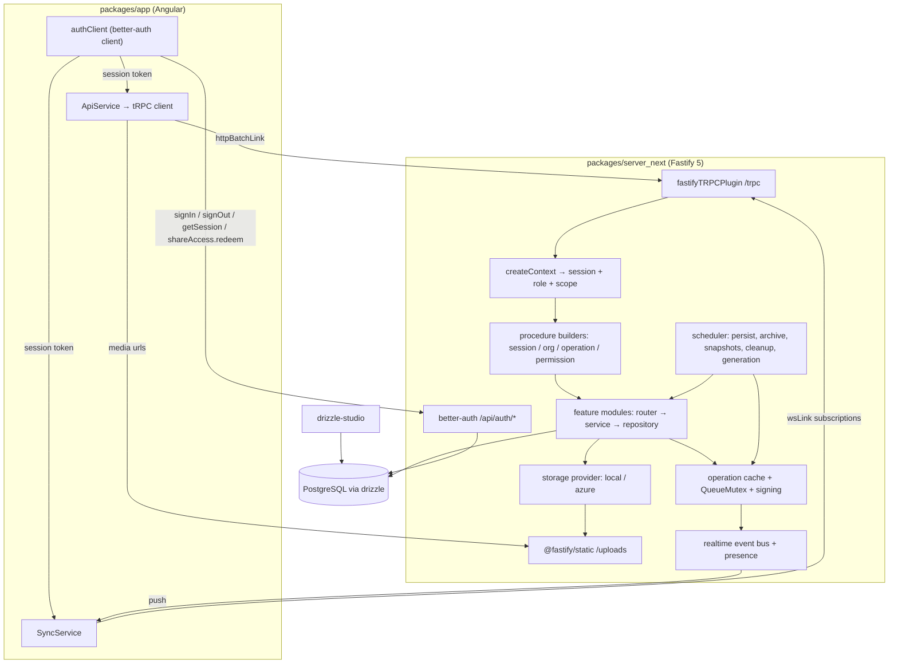

# Requirements

### Overview & Goals

Replace the Strapi 5 backend (`packages/server`) with a purpose-built backend in `packages/server_next` (currently only an empty `REQUIREMENTS.md`) built on **Fastify 5 + tRPC 11 + Drizzle ORM + better-auth**, with **drizzle-studio** as the admin GUI.

Goals:

- **All application traffic goes through tRPC** — queries, mutations *and* subscriptions. socket.io and the Strapi REST `/api/...` surface disappear. **Authentication is the deliberate exception** and is not wrapped in tRPC procedures.
- **better-auth owns identity, sessions and role-based access control**, including the operation share-link mechanism. The Angular app drives every authentication flow through the official **better-auth client** (`createAuthClient`) against the server's `/api/auth/*` handler, so client and server stay a matched pair and we inherit its session, cookie and token handling instead of re-implementing it behind tRPC.
- **Drizzle owns the schema** — greenfield tables, real FKs, real unique constraints, SQL migrations under version control.
- **No Strapi admin panel** — drizzle-studio for data inspection/editing, seed + CLI scripts for operational tasks.
- **Full functional parity** with today's backend, verified against the existing Angular app and Playwright e2e suite.

### Scope

#### In Scope

- New package `packages/server_next` (`@zskarte/server-next`) replacing `@zskarte/server`.
- Domain modules: operations + map-state changesets, journal entries, accesses/share links, organizations, map layers, WMS sources, map snapshots, signing keys, map-layer generation config, version, proxy.
- Real-time push over tRPC WebSocket subscriptions (changesets, journal updates, presence/`currentLocation`).
- better-auth with username/password (via the `username` plugin, matching today's `zso_*` login identifiers), bearer sessions, an explicit role→permission matrix ported from `packages/server/config/sync/*.json`, and share-link sessions scoped to a single operation — served over better-auth's own HTTP surface at `/api/auth/*`, including the custom `shareAccess` plugin's endpoints.
- A better-auth **client plugin** shipped next to the server plugin so `authClient.shareAccess.*` and the additional user/session fields are typed end-to-end in the Angular app.
- File storage replacing Strapi's upload plugin: `files` table + local-disk and Azure Blob providers + `/uploads/*` static serving.
- Port of the map-layer generation pipeline (`packages/server/src/state/maplayer.ts`, ~1350 lines) and its worker thread.
- Scheduled jobs: 15 s map-state persistence, hourly auto-archive + expired-token cleanup, 5 min snapshots, nightly guest-operation purge, semi-monthly map-layer regeneration.
- Angular changes: `packages/app/src/app/api/api.service.ts` reimplemented on a typed tRPC client; a new `auth.client.ts` wrapping `createAuthClient` for every authentication flow; `session.service.ts` rebuilt on that client; `sync.service.ts` moved from socket.io to tRPC subscriptions; all call sites in the ~15 consuming services updated.
- Root wiring: workspace scripts, `Dockerfile`, `docker-compose.yml`, developer docs; removal of `packages/server`.

#### Out of Scope

- Migrating existing production data. The schema is greenfield with a fresh seed; a production data migration is a separate, later task.
- Any change to map rendering, drawing, PDF/Excel export or offline (Dexie) behaviour in the Angular app beyond the transport swap.
- New product features. Behaviour is deliberately frozen at today's semantics except where noted as an explicit improvement (DB-enforced journal message numbers, type-enforced access scoping).
- OAuth/social login, 2FA, email verification (no mail infrastructure exists today).
- A custom admin web UI — drizzle-studio plus CLI scripts only.

### User Stories

- As an **organization user**, I log in with username/password and see only my organization's operations, journal entries, layers and WMS sources — exactly as before.
- As a **share-link recipient**, I redeem a 6-digit or 32-char token and get read/write access limited to one operation, with no ability to reach any other operation or organization.
- As a **user drawing on the map**, my changeset is accepted, signed, applied to the authoritative map state and pushed to every other client on that operation within the same latency budget as today.
- As a **journal user**, my entry receives a unique, gap-free message number per operation even when several people create entries at once.
- As a **developer**, I run `npm run start` and get Postgres, the new backend and the app; I inspect and fix data in drizzle-studio instead of the Strapi admin.
- As an **operator**, I trigger map-layer regeneration with a CLI command and see the same generated layers and styles as today.

### Functional Requirements

1. **Endpoint parity.** Every route in `packages/server/src/api/*/routes/*` has an equivalent tRPC procedure — except the authentication routes, which map onto better-auth endpoints (see the *API Mapping* tab). The `identifier` and `operationId` HTTP headers become explicit, validated procedure inputs.
2. **Authentication runs on better-auth, not tRPC.** Sign-in, sign-out, session retrieval/refresh and share-token redemption are invoked through `authClient` (`signIn.username`, `signOut`, `getSession`, `shareAccess.redeem`) and served by better-auth at `/api/auth/*`. There is no `auth.*` tRPC router. The session established this way is the *same* session tRPC reads in `createContext`, for both HTTP and WebSocket connections.
3. **Session payload parity with `/api/users/me`.** better-auth's `customSession` plugin enriches the session with the caller's organization (including `wms_sources` / `map_layer_favorites` as numeric-id arrays), so one `authClient.getSession()` replaces today's `GET /api/users/me`.
4. **Response-shape compatibility.** Paginated list procedures return `{ data, meta: { pagination: { page, pageSize, pageCount, total } } }` so `StrapiApiResponseList<T>` consumers (`journal.service.ts`, `sidebar-history.component.ts`) keep working. Entities expose both `id` (integer) and `documentId` (stable text id), because the app relies on both — `organization.wms_sources` / `map_layer_favorites` are numeric-id arrays.
5. **Date fidelity.** superjson stays the tRPC transformer so `Date` round-trips as today (`packages/server/src/middlewares/superjson.ts` is replaced by the transformer). better-auth keeps its own JSON encoding; the handful of date fields in the session payload are normalized at the `SessionService` boundary.
6. **Authorization parity.** The five roles (`organization`, `guest`, `operationread`, `operationwrite`, `public`) keep exactly the permission sets defined in `config/sync/*.json`. Archived operations reject all mutations except `unarchive` / `shadowDelete` / read.
7. **Scoping is not client-controllable.** No procedure accepts raw filters. Organization/operation predicates are injected server-side, replacing the `globalSecurity` filter-stripping middleware.
8. **Changeset integrity.** Per-operation serialization via the ported `QueueMutex` (15 s max wait → `TOO_MANY_REQUESTS`), duplicate-submit detection, `verifyChangesetConsistency`, inverse-patch verification, ed25519/RSA signing, author-IP capture.
9. **Real-time.** Subscribers on an operation receive `{ changeset, sign }`, journal changes, and the presence list (`user`, `identifier`, `label`, `currentLocation`); the originating `identifier` is excluded, as today.
10. **Share-link lifecycle.** Long tokens (32 hex chars) persist; short tokens (6 digits) expire after 15 minutes and are consumed on redemption; expired rows are purged hourly. Redemption goes through the better-auth `shareAccess` plugin; *issuing* and revoking share links stays a domain concern on the tRPC `access` router.
11. **Version handshake.** `version.compatibility` compares major versions and reports `backendVersion`.
12. **Generated map layers.** The generation pipeline produces the same `map_layers`, files and styles, driven by the same config row, runnable on schedule and on demand.

### Non-Functional Requirements

- **Single-instance backend.** The authoritative map state lives in memory (as today) and is flushed every 15 s; horizontal scaling is explicitly unsupported and documented.
- **Node ≥ 22.14**, TypeScript, ESM, Fastify 5 (required by tRPC 11), Postgres 16+.
- **Graceful shutdown** must flush the operation cache and abort queued changesets before exit (parity with `destroy()` in `packages/server/src/index.ts`).
- **Security:** CORS restricted to configured origins (no `origin: '*'`), better-auth rate limiting enabled, `useSecureCookies` in production, secrets validated at boot via zod, access tokens and private keys never serialized to clients.
- **Tooling:** biome lint (`lint:server-next`), vitest for unit/integration tests (matching `packages/app`), `drizzle-kit generate`/`migrate` for schema changes.

# Technical Design

### Current Implementation

| Concern | Today (`packages/server`) |
|---|---|
| HTTP | Strapi 5 / Koa, auto-generated REST controllers + custom routes |
| Content types | 8 collection types + 1 single type as `schema.json` files, plus `plugin::users-permissions` user/role and `plugin::upload` file/folder |
| Auth | `users-permissions` JWT; `documentId`-scoped share tokens carry `operationId` / `organizationId` / `permission` claims in the JWT |
| RBAC | Role permission sets exported to `config/sync/user-role.*.json`, edited in the Strapi admin |
| Authorization | `src/middlewares/accessControl.ts` (466 lines) injects `ctx.query.filters` per content type; `globalSecurity.ts` strips client filters and asserts the middleware ran |
| Map state | `src/state/operation.ts` in-memory `operationCaches` + `utils/queue-mutex.ts`, immer patches, ed25519/RSA signing, 15 s persistence cron |
| Real-time | `src/state/socketio.ts` — socket.io rooms per operation, presence + changeset + journal broadcast |
| Files | `plugin::upload` with local or `strapi-provider-upload-azure-storage` provider |
| Generation | `src/state/maplayer.ts` + `src/workers/map-layer-processor.ts`, triggered by cron or an admin-JWT-protected endpoint |
| Serialization | `src/middlewares/superjson.ts` wraps every `/api/` response |

### Key Decisions

1. **tRPC for domain traffic, `ApiService`-shaped call sites (confirmed).** `packages/app/src/app/api/api.service.ts` is reimplemented over `createTRPCClient`; each existing call site swaps `this._api.get('/api/operations/overview?phase=…')` for `this._trpc.operation.overview.query({ phase })`. No REST shim is kept for domain endpoints.
2. **Authentication goes through the better-auth client, not tRPC (confirmed).** The app uses `createAuthClient` (`better-auth/client`) with `inferAdditionalFields<typeof auth>()`, `usernameClient()` and the `shareAccessClient()` plugin, talking to the better-auth handler at `/api/auth/*`. Rationale: the client is derived from the same server config, so sign-in, sign-out, session refresh, error codes and the custom share-link endpoints stay in lockstep with the server; hand-written `auth.*` tRPC procedures would duplicate that logic and drift. Both transports read the *same* session — the token/cookie better-auth establishes is what `createContext` resolves for HTTP and WS.
3. **Login stays username-based via better-auth's `username` plugin.** `login.component.ts` signs in with the organization's user name (`selectedOrganization.identifier`, e.g. `zso_guest`), not an email, so the server enables `username()` and the app calls `authClient.signIn.username({ username, password })`. Seeded users get a synthetic, non-deliverable email (`<username>@zskarte.local`) because better-auth requires the field; no mail is ever sent.
4. **`customSession` replaces `GET /api/users/me`.** `customSession(async ({ user, session }) => ({ user, session, organization: await organizationRepository.forSession(session) }))` returns the populated organization the app needs at boot, so `SessionService` needs exactly one call after login. Note the better-auth semantics: custom session fields are never cookie-cached and are always resolved server-side, so organization edits are picked up on the next `getSession()`.
5. **Greenfield schema, dual identity retained (confirmed).** New snake_case tables with FKs; every domain table keeps `id serial primary key` **and** `document_id text unique` because the Angular app uses `documentId` as the primary handle while `organization.wms_sources` / `map_layer_favorites` store numeric `id`s.
6. **Real-time over tRPC WebSocket subscriptions (confirmed).** `@fastify/websocket` + `useWSS: true`, auth via `connectionParams` carrying the better-auth bearer token; presence is derived from subscription lifecycle exactly like socket.io connections today.
7. **better-auth for identity only; permissions in code (confirmed).** `user` / `session` / `account` / `verification` are better-auth-owned; `organizations` stays a domain table referenced by `user.organizationId`. The five roles become an explicit matrix in `src/auth/permissions.ts`, a literal port of `config/sync/*.json`, so the current behaviour is auditable line-by-line.
8. **Feature-module structure (confirmed).** `src/modules/<feature>/{router,service,repository,schema}.ts`, aggregated into one `appRouter` and one drizzle schema barrel.
9. **Share links are better-auth sessions, not JWT claims.** A custom better-auth plugin (`shareAccess`) exposes token redemption/refresh as regular better-auth endpoints and creates a session for the pseudo-user (`operation_read` / `operation_write` / `operation_all`) with additional session fields `operationId`, `organizationId`, `permission`. It ships with a matching client plugin, so the app calls `authClient.shareAccess.redeem({ token })`. One session table, one revocation path, no bespoke token verification. *Issuing* and revoking share links stays domain work on the tRPC `access` router.
10. **Scoping enforced by types, not by a runtime assertion.** Repository functions require a `scope: { organizationId: string; operationId?: string }` argument, so a query that forgets tenant scoping does not compile. This replaces `globalSecurity`'s `accessControlExecuted` runtime check.
11. **Journal numbering moves into the database.** A `unique (operation_id, organization_id, message_number)` constraint plus a bounded retry loop replaces the count-and-repair logic in `journal-entry/controllers/journal-entry.ts`.
12. **No admin HTTP surface.** `middlewares/admin-auth.ts` and `POST /map-layer-generation-configs/trigger-update` are replaced by an `npm run maplayer:generate` CLI script; data edits happen in drizzle-studio.
13. **No client upload endpoints.** Verified: the app never sends `FormData` — it only reads `media_source.url` and numeric media ids. File *writes* come from the generation pipeline and seed/CLI scripts; the server only needs `files` rows plus static serving.

### Proposed Changes

#### Runtime & composition

`src/server.ts` builds the Fastify instance: `routerOptions.maxParamLength: 5000` (required for `httpBatchLink` paths), `@fastify/cors` with configured origins and the `Identifier`/`OperationId` headers no longer needed, `@fastify/static` for `/uploads`, better-auth mounted at `/api/auth/*`, then `@fastify/websocket` **before** `fastifyTRPCPlugin` (`prefix: '/trpc'`, `useWSS: true`, `keepAlive`). `src/index.ts` orchestrates boot: validate env → run drizzle migrations → initialize signing keys → load active operations into cache → register schedulers → listen; and shutdown: flush cache → abort queued changesets → close.

#### Auth & authorization

Authentication is served entirely by better-auth: the handler is mounted at `/api/auth/*` and consumed by the better-auth client in the app. tRPC never proxies it.

```ts
// src/auth/auth.ts
export const auth = betterAuth({
  database: drizzleAdapter(db, { provider: 'pg' }),
  emailAndPassword: { enabled: true },
  user: { additionalFields: { organizationId: { type: 'string', required: false }, zsRole: { type: 'string' } } },
  session: {
    expiresIn: env.SESSION_EXPIRES_IN,
    updateAge: env.SESSION_UPDATE_AGE,          // rolling refresh replaces GET /accesses/auth/refresh
    additionalFields: { operationId: { type: 'string', required: false }, organizationId: { type: 'string', required: false }, permission: { type: 'string', required: false } },
  },
  plugins: [
    bearer(),
    username(),                                 // the app logs in with `zso_*` user names, not emails
    shareAccess({ /* redeem + refresh share tokens → operation scoped session */ }),
    customSession(async ({ user, session }) => ({
      user,
      session,
      organization: await organizationRepository.forSession(session), // parity with GET /api/users/me
    })),
  ],
  trustedOrigins: env.TRUSTED_ORIGINS,
  rateLimit: { enabled: true, window: 60, max: 100 },
  advanced: { useSecureCookies: env.isProduction },
});

export type Auth = typeof auth;   // consumed by the app's auth client for full type inference
```

```ts
// packages/app/src/app/api/auth.client.ts
export const authClient = createAuthClient({
  baseURL: environment.backendUrl,                       // handler lives at `${backendUrl}/api/auth`
  plugins: [inferAdditionalFields<Auth>(), usernameClient(), shareAccessClient()],
  fetchOptions: { credentials: 'include' },
});
// authClient.signIn.username({ username, password }) · authClient.signOut() · authClient.getSession()
// authClient.shareAccess.redeem({ token })
```

`SessionService` keeps its current public API (`login`, `shareLogin`, `logout`, `observeAuthenticated`, `observeOrganization`) but implements it on `authClient`; the resulting session token is handed to the tRPC links (`Authorization: Bearer …` header and WS `connectionParams`) so both transports authenticate as one session.

```ts
// src/trpc/procedures.ts
export const publicProcedure = t.procedure;
export const sessionProcedure = t.procedure.use(requireSession);   // narrows ctx.session to non-null
export const orgProcedure = sessionProcedure.use(requireOrgScope); // adds ctx.scope.organizationId
export const operationProcedure = orgProcedure
  .input(z.object({ operationId: z.string() }))
  .use(requireOperationAccess);  // ownership + share-session match + phase guard
export const requirePermission = (key: PermissionKey) => t.middleware(/* matrix lookup on ctx.role */);
```

`requireOperationAccess` is the distilled port of `accessControl.ts`: verify the operation belongs to `ctx.scope.organizationId` (or equals the share session's `operationId`), reject mutations on non-active operations except `unarchive` / `shadowDelete` / reads, and log violations in the same format for continuity of ops dashboards.

#### Map state & real-time

`modules/operation/cache.ts` is a near-literal port of `state/operation.ts` (immer `applyPatches`, `verifyChangesetConsistency` and `updateChangesetIdsAfterApply` from `@zskarte/common`, duplicate detection, inverse-patch verification, `changed` flag). `lib/queue-mutex.ts` ports `utils/queue-mutex.ts`; the Koa `ctx`-based client-abort detection is re-bound to the tRPC request `signal`.

`realtime/event-bus.ts` holds a per-operation `EventEmitter` and a presence registry keyed by `identifier`. Subscriptions are async generators that register on start and deregister on abort, then broadcast the new presence list — the same lifecycle socket.io gives today.

#### Files & generation

`modules/file/storage.ts` defines `StorageProvider { save, replace, delete, publicUrl }` with `LocalStorageProvider` (writes under `public/uploads`, served by `@fastify/static`) and `AzureBlobStorageProvider` (`@azure/storage-blob`), chosen by `STORAGE_PROVIDER`. The `files` table keeps `url`, `formats`, `provider` so `packages/app/src/app/helper/strapi-utils.ts` (`mapInternalUrl`, responsive `srcSet`) works untouched. `modules/map-layer-generation/` ports `state/maplayer.ts` and the worker, with `strapi.documents(...)` calls replaced by repositories and `strapi.plugin('upload')` calls by the storage provider; the folder concept collapses into a `folder_path` column.

### Data Models / Contracts

```ts
// src/modules/operation/schema.ts (representative)
export const operationPhase = pgEnum('operation_phase', ['active', 'archived', 'deleted']);

export const operations = pgTable('operations', {
  id: serial('id').primaryKey(),
  documentId: text('document_id').notNull().unique().$defaultFn(() => nanoid()),
  name: text('name').notNull(),
  description: text('description'),
  organizationId: integer('organization_id').references(() => organizations.id, { onDelete: 'cascade' }),
  mapState: jsonb('map_state').$type<ZsMapState>(),
  changesets: jsonb('changesets').$type<Record<string, IZsChangeset>>(),
  changesetSigns: jsonb('changeset_signs').$type<Record<string, string>>(),
  signingKeyIds: jsonb('signing_key_ids').$type<string[]>(),
  eventStates: jsonb('event_states').$type<number[]>(),
  mapLayers: jsonb('map_layers'),
  phase: operationPhase('phase').notNull().default('active'),
  createdAt: timestamp('created_at', { withTimezone: true }).notNull().defaultNow(),
  updatedAt: timestamp('updated_at', { withTimezone: true }).notNull().defaultNow(),
});

// src/modules/journal/schema.ts — numbering now enforced by the DB
export const journalEntries = pgTable('journal_entries', { /* … 25 columns … */ }, (t) => [
  unique('journal_entries_number_unique').on(t.operationId, t.organizationId, t.messageNumber),
  uniqueIndex('journal_entries_uuid_unique').on(t.uuid),
]);
```

```ts
// src/modules/operation/router.ts (representative)
export const operationRouter = router({
  overview: orgProcedure
    .use(requirePermission('operation.overview'))
    .input(z.object({ phase: z.enum(['active', 'archived', 'all']).default('active') }))
    .query(({ ctx, input }) => operationService.overview(ctx.scope, input)),

  submitChangeset: operationProcedure
    .use(requirePermission('operation.changeset'))
    .input(z.object({ operationId: z.string(), identifier: z.string(), changeset: changesetSchema }))
    .mutation(({ ctx, input, signal }) => operationService.addChangeset(ctx, input, signal)),

  onChangeset: operationProcedure
    .input(z.object({ operationId: z.string(), identifier: z.string() }))
    .subscription(({ input }) => operationEvents.changesets(input.operationId, input.identifier)),

  onConnections: operationProcedure
    .input(z.object({ operationId: z.string(), identifier: z.string(), label: z.string() }))
    .subscription(({ ctx, input }) => presence.track(ctx, input)),
});
```

```ts
// src/auth/permissions.ts — literal port of config/sync/user-role.*.json
export const ROLE_PERMISSIONS = {
  organization: new Set<PermissionKey>(['operation.create', 'operation.patch', 'access.generate', /* 42 keys */]),
  guest: new Set<PermissionKey>([/* 27 keys */]),
  operationwrite: new Set<PermissionKey>([/* 25 keys */]),
  operationread: new Set<PermissionKey>([/* 16 keys */]),
  public: new Set<PermissionKey>([/* 10 keys */]),
} as const;
```

### Components

| Component | Change |
|---|---|
| `packages/server_next/src/**` | **New.** Entire backend. |
| `packages/app/src/app/api/api.service.ts` | **Rewritten** as a thin typed wrapper over `createTRPCClient` (`splitLink` → `wsLink` for subscriptions, `httpBatchLink` otherwise, superjson transformer, bearer token taken from `authClient`). Domain traffic only. |
| `packages/app/src/app/api/auth.client.ts` | **New.** `createAuthClient` with `inferAdditionalFields<Auth>()` + `shareAccessClient()`; the single entry point for sign-in, sign-out, session retrieval/refresh and share-token redemption. |
| `packages/app/src/app/api/transformer.ts` | **Deleted.** Strapi `data`/`attributes` unwrapping is obsolete. |
| `packages/app/src/app/sync/sync.service.ts` | **Rewritten.** socket.io client → tRPC subscriptions for changesets, journal and presence; `publishCurrentLocation` becomes a mutation; WS auth uses the better-auth token via `connectionParams`. |
| `packages/app/src/app/session/session.service.ts` | **Rewritten on `authClient`**: `login` → `signIn.email`, `shareLogin` → `shareAccess.redeem`, `me`/refresh → `getSession` (organization included by `customSession`), `logout` → `signOut`. Organization *settings* mutations stay on the tRPC `organization.*` procedures. Public method signatures unchanged. |
| `journal.service.ts`, `operation.service.ts`, `map-layer.service.ts`, `wms.service.ts`, `signing.service.ts`, `changeset.service.ts`, `version.service.ts`, `login.component.ts`, `revoke-share-dialog.component.ts`, `sidebar-history.component.ts`, `change-detail.component.ts` | Call sites switched to typed procedures; public method signatures unchanged. |
| `packages/app/src/app/helper/strapi-utils.ts` | Kept (renamed `media-utils.ts`); `mapInternalUrl` still points at the backend origin. |
| `packages/server` | **Deleted** in the final stage. |
| Root `package.json`, `Dockerfile`, `docker-compose.yml`, `DEVELOPER_GUIDE.md`, `README.md` | Scripts, build/lint targets, ports and docs retargeted at `server_next`; `DEVELOPER_GUIDE.md`'s "add new types" chapter rewritten around drizzle + tRPC. |

### File Structure

```
packages/server_next/
  package.json  tsconfig.json  drizzle.config.ts  .env.example
  drizzle/                       # generated SQL migrations
  public/uploads/                # local storage provider target
  src/
    index.ts  server.ts  env.ts
    db/{client.ts,schema.ts,auth-schema.ts,seed.ts,migrate.ts}
    auth/{auth.ts,permissions.ts,share-access-plugin.ts,share-access-client.ts,handler.ts}
                                   # share-access-client.ts + `type Auth` are re-exported for the angular auth client
    trpc/{trpc.ts,context.ts,procedures.ts,router.ts}
    modules/
      operation/{router,service,repository,schema,cache}.ts
      journal/{router,service,repository,schema}.ts
      access/{router,service,repository,schema}.ts
      organization/{router,service,repository,schema}.ts
      map-layer/{router,service,repository,schema}.ts
      wms-source/{router,service,repository,schema}.ts
      map-snapshot/{router,service,repository,schema}.ts
      signing-key/{service,repository,schema}.ts
      file/{storage.ts,repository.ts,schema.ts}
      map-layer-generation/{service.ts,schema.ts,worker.ts,cli.ts}
      misc/{version.router.ts,proxy.router.ts}
    realtime/{event-bus.ts,presence.ts}
    jobs/scheduler.ts
    lib/{queue-mutex.ts,signing.ts,logger.ts,pagination.ts}
  test/**                        # vitest
```

### Architecture Diagram



### Risks

| Risk | Mitigation |
|---|---|
| **Authorization regression** — `accessControl.ts` encodes years of hard-won edge cases (share tokens, `public` layers, archived operations, forced-id rejection). | Port it as an explicit table of cases with a dedicated vitest suite asserting each role × each procedure, including the negative cases; keep the identical violation log format. |
| **Changeset correctness** — map state is the product's crown jewel; a subtle port bug silently corrupts drawings. | Port `state/operation.ts` and `queue-mutex.ts` with minimal edits; reuse `@zskarte/common` verification helpers unchanged; add concurrency tests (parallel submits, duplicate submit, stale base state, abort/timeout). |
| **Presence semantics differ between socket.io and tRPC subscriptions** (reconnect storms, the app's 15-minute idle reconnect). | Implement presence purely from subscription start/abort; keep `keepAlive` pings; validate with two browser sessions plus a forced network drop. |
| **superjson + tRPC batching** changes error payload shapes the app inspects (`error.status`, `NetworkError`, `JSON.parse` string matching in `session.service.ts`). | Map `TRPCClientError` to the `{ status, message }` shape those branches expect inside the new `ApiService`; map better-auth's `{ error: { code, status, message } }` in `SessionService` (its documented error codes replace the string matching). |
| **Two clients, one session** — better-auth and the tRPC links must agree on how the session travels (cookie vs bearer, CORS credentials, WS handshake). | Standardize on the `bearer()` plugin token stored by `authClient`, injected into `httpBatchLink` headers and `wsLink` `connectionParams`; keep `credentials: 'include'` and `trustedOrigins` aligned with the CORS origins; cover with an integration test that logs in via better-auth and then calls a protected procedure over both HTTP and WS. |
| **Angular build pulling server code** through the `AppRouter` type import. | Export `AppRouter` from a types-only entrypoint and import it with `import type` only; verify bundle size after the switch. |
| **Generation pipeline port** is the largest single chunk and depends on Strapi's folder/file model. | Do it last, behind `MAPLAYER_GENERATION_ENABLED`; compare generated layer/file inventory against a Strapi-generated baseline before removing `packages/server`. |
| **Loss of the Strapi admin** for day-to-day org/user administration. | Seed + CLI scripts for create-organization / create-user / reset-password / issue-share-link, plus documented drizzle-studio workflows in `DEVELOPER_GUIDE.md`. |

# API Mapping

### Auth & session — **better-auth, not tRPC**

All rows below are served by the better-auth handler at `/api/auth/*` and called through `authClient` in the app. There is no `auth.*` tRPC router.

| Today | New (better-auth endpoint) | App call |
|---|---|---|
| `POST /api/auth/local` (`{ identifier, password }`) | `POST /api/auth/sign-in/username` (`username` plugin — the app logs in with `zso_*` user names) | `authClient.signIn.username({ username, password })` |
| `GET /api/users/me` | `GET /api/auth/get-session` (enriched by the `customSession` plugin with the populated organization, incl. `wms_sources` / `map_layer_favorites` as numeric id arrays, mirroring `extensions/users-permissions/strapi-server.ts`) | `authClient.getSession()` |
| `GET /api/accesses/auth/refresh` | rolling session refresh via `session.updateAge` on `get-session`, plus `POST /api/auth/share-access/refresh` for share sessions | `authClient.getSession()` / `authClient.shareAccess.refresh()` |
| `POST /api/accesses/auth/token` | `POST /api/auth/share-access/redeem` (`shareAccess` plugin: token → operation-scoped session) | `authClient.shareAccess.redeem({ token })` |
| *(implicit; app just dropped the JWT)* | `POST /api/auth/sign-out` | `authClient.signOut()` |
| — | `GET /api/auth/ok` (health of the auth handler) | — |

| Today | New (tRPC — domain side of share links) |
|---|---|
| `POST /api/accesses/auth/token/generate` | `access.generate` (`{ name, type, operationId, tokenType }`) |

### Accesses

| Today | New |
|---|---|
| `GET /api/accesses?operationId=…&sort[0]=type` | `access.list({ operationId, sort })` |
| `GET /api/accesses/:id` | `access.byId({ documentId })` |
| `POST` / `PUT` / `DELETE /api/accesses/:id` | `access.create` / `access.update` / `access.delete` |

### Organizations

| Today | New |
|---|---|
| `GET /api/organizations/forlogin` | `organization.forLogin` (public; name + logo + users) |
| `GET /api/organizations` | `organization.current` |
| `PUT /api/organizations/:id/settings` | `organization.updateSettings` |
| `PUT /api/organizations/:id/layer-settings` | `organization.updateLayerSettings` (numeric-id allowlist preserved) |
| `PUT /api/organizations/:id/journal-entry-template` | `organization.updateJournalEntryTemplate` |

### Operations & map state

| Today | New |
|---|---|
| `GET /api/operations/overview?phase=…` | `operation.overview({ phase })` |
| `GET /api/operations/:id` | `operation.byId({ documentId })` — merges live cache state, as today |
| `POST /api/operations` | `operation.create` |
| `PUT /api/operations/:id/meta` | `operation.updateMeta` (allowlist `name`, `description`, `eventStates`) |
| `PUT /api/operations/:id/mapLayers` | `operation.updateMapLayers` |
| `PUT /api/operations/:id/archive` \| `/unarchive` \| `/shadowdelete` | `operation.archive` / `operation.unarchive` / `operation.shadowDelete` |
| `POST /api/operations/mapstate/changeset` + `identifier`/`operationId` headers | `operation.submitChangeset({ operationId, identifier, changeset })` |
| `POST /api/operations/mapstate/currentlocation` | `operation.publishCurrentLocation({ operationId, identifier, long, lat })` |

### Real-time (replacing socket.io events)

| Today | New |
|---|---|
| `WebsocketEvent.STATE_CHANGESET` | `operation.onChangeset` subscription |
| `WebsocketEvent.STATE_JOURNAL` | `journal.onChanged` subscription |
| `WebsocketEvent.CONNECTIONS` | `operation.onConnections` subscription (presence, `currentLocation`) |
| socket handshake `auth.token` + `query.operationId/identifier/label` | `wsLink` `connectionParams` + subscription inputs |

### Journal

| Today | New |
|---|---|
| `GET /api/journal-entries?operationId=…&pagination[…]` | `journal.list({ operationId, page, pageSize })` → `{ data, meta.pagination }` |
| `GET /api/journal-entries/:id` | `journal.byId({ documentId })` |
| `GET /api/journal-entries/by-number/:number?operationId=…` | `journal.byNumber({ operationId, messageNumber })` |
| `POST /api/journal-entries` | `journal.create({ identifier, entry })` — DB-enforced unique message number |
| `PUT /api/journal-entries/:idOrUuid` | `journal.update({ identifier, documentId \| uuid, data })` |

### Layers, sources, snapshots, misc

| Today | New |
|---|---|
| `GET/POST/PUT/DELETE /api/map-layers[/:id]` | `mapLayer.list` / `create` / `update` / `delete` (public-layer visibility preserved) |
| `GET/POST/PUT/DELETE /api/wms-sources[/:id]` | `wmsSource.list` / `create` / `update` / `delete` |
| `GET /api/map-snapshots?operationId=…&fields[…]&sort[…]&pagination[…]` | `mapSnapshot.list({ operationId, page, pageSize, fields })` → `{ data, meta.pagination }` |
| `GET /api/map-snapshots/:id` | `mapSnapshot.byId({ documentId })` |
| `GET /api/signing-key/bykey/:keyId` | `signingKey.byKeyId({ keyId })` (public key only) |
| `GET /api/version`, `GET /api/version/compatibility?version=…` | `version.get`, `version.compatibility({ version })` |
| `GET /api/proxy?url=…` | `proxy.fetch({ url })` (with an allowlist, closing today's open-proxy gap) |
| `POST /api/map-layer-generation-configs/trigger-update` (admin JWT) | `npm run maplayer:generate` CLI — no HTTP surface |
| `GET /uploads/*` (Strapi public middleware) | `@fastify/static` at `/uploads` (local provider) or Azure Blob URLs |

# Testing

### Validation Approach

The new backend must be provably interchangeable with the old one from the app's point of view. Validation runs on three levels:

1. **Unit / integration tests (vitest)** inside `packages/server_next/test`, run against a real Postgres (the existing `docker-compose` service, separate database name) with drizzle migrations applied per run.
2. **Contract checks** — for each procedure, assert the returned shape against what the corresponding Angular consumer expects (notably `{ data, meta.pagination }` lists, dual `id`/`documentId`, `Date` instances after superjson).
3. **End-to-end** — start `server_next` + the app and run the existing Playwright suite (`packages/app: npm run test:e2e`) plus the app's vitest suite (`changeset.service.spec.ts` already asserts changeset submission).

### Key Scenarios

- **Login & session (better-auth):** `authClient.signIn.username` succeeds for an org user and `getSession()` returns the populated organization; guest login (`zso_guest`); invalid credentials return a better-auth error code; the session is accepted by tRPC over both `httpBatchLink` and `wsLink`; rolling refresh extends the session; `signOut` invalidates it for tRPC too.
- **Share links:** `access.generate` issues long and short tokens over tRPC; `authClient.shareAccess.redeem` exchanges a short token once (15-minute expiry, consumed on use); the redeemed session can read/write only its operation; `notForShare` procedures reject share sessions.
- **Role matrix:** for each of the five roles, call every procedure and assert allow/deny exactly matches `config/sync/user-role.*.json`.
- **Tenant isolation:** user of org A cannot read, update or delete any entity of org B (operations, journal entries, layers, WMS sources, snapshots, accesses); creating an entity with a foreign `organization`/`operation` is rejected; forced `id`/`documentId` on create is rejected.
- **Changesets:** happy path applies patches, signs and persists; duplicate submit with identical content returns `alreadySubmitted`; duplicate with different content errors; inconsistent base state rejected; non-reversible inverse patches rejected; two concurrent submits serialize; lock timeout yields `TOO_MANY_REQUESTS`; archived operation rejects submission.
- **Journal numbering:** sequential auto-numbering; negative (offline) number reclaimed when free; explicit duplicate number → conflict; N parallel creates produce N distinct numbers.
- **Real-time:** two subscribers on one operation — a changeset from A reaches B but not A; journal update propagates; presence list updates on connect/disconnect and on `publishCurrentLocation`; unauthorized `connectionParams` closes the socket.
- **Scheduled jobs:** 15 s persistence writes cache to DB; operations idle > 7 days auto-archive; snapshots created only for recently updated operations with correct `changesetIds` diffing; expired access rows purged; guest operations purged.
- **Files:** local provider writes and `/uploads/...` serves; `files` rows expose `url`/`formats`/`provider` so `mapInternalUrl` and responsive `srcSet` resolve.
- **Generation pipeline:** with fixture archives, layers/files/styles are created idempotently on a second run; `enabled: false` short-circuits.

### Edge Cases

- Graceful shutdown mid-changeset: queued tasks abort, cache is flushed, no data loss.
- Operation archived while a client holds an open subscription → subscription terminates cleanly.
- Unarchiving repopulates the in-memory cache.
- `operation.byId` on an operation that is *not* cached (archived) returns persisted state.
- WebSocket reconnect after network loss does not duplicate presence entries.
- Version mismatch: major-version skew reports incompatible.
- `proxy.fetch` rejects non-allowlisted hosts.

### Test Changes

- **Add:** `packages/server_next/test/**` — auth-handler (sign-in → protected procedure over HTTP and WS, share-token redemption), role-matrix, tenant-isolation, changeset-concurrency, journal-numbering, realtime, scheduler and pagination-contract suites; vitest config plus a DB setup/teardown helper.
- **Update:** `packages/app/src/app/changeset/changeset.service.spec.ts` — its `'/api/operations/mapstate/changeset'` assertion becomes a tRPC procedure-call assertion.
- **Update:** root/app scripts so `npm run lint` and the test targets cover `server_next` and no longer reference `packages/server`.
- **Reuse:** the Playwright e2e suite unchanged, as the acceptance gate before deleting `packages/server`.

# Delivery Steps

### ✓ Step 1: Scaffold server_next: Fastify + tRPC + drizzle schema and tooling
`npm run start:server-next` boots a Fastify server exposing an empty tRPC router, with the full greenfield drizzle schema migrated into Postgres and drizzle-studio able to browse it.

- Create `packages/server_next/package.json` (`@zskarte/server-next`, ESM, Node ≥ 22) with Fastify 5, `@trpc/server` 11, `drizzle-orm`, `drizzle-kit`, `pg`, `zod`, `superjson`, `@fastify/cors`, `@fastify/static`, `@fastify/websocket`, `croner`, plus vitest; add `tsconfig.json` and `.env.example` (DB, `BETTER_AUTH_*`, `SIGN_*`, `STORAGE_*`, `TRUSTED_ORIGINS`).
- Add `src/env.ts` (zod-validated config), `src/lib/logger.ts`, `src/db/client.ts` (`drizzle(new Pool(...))`) and `src/db/migrate.ts`.
- Write the drizzle schema per module under `src/modules/*/schema.ts`, ported from the Strapi `schema.json` files: `organizations`, `operations`, `map_snapshots`, `journal_entries`, `accesses`, `map_layers`, `wms_sources`, `signing_keys`, `map_layer_generation_config`, `files` — each with `id serial` **and** `document_id text unique`, real FKs, pgEnums for `phase`/`type`/`entryStatus`/`department`/`defaultLocale`/`keyType`, and a `unique(operation_id, organization_id, message_number)` constraint on journal entries.
- Barrel everything in `src/db/schema.ts`; add `drizzle.config.ts` and generate the initial migration in `drizzle/`.
- Add `src/trpc/trpc.ts` (`initTRPC` with the superjson transformer), an empty `src/trpc/router.ts`, `src/server.ts` (`routerOptions.maxParamLength: 5000`, CORS, `@fastify/static` for `/uploads`, `fastifyTRPCPlugin` at `/trpc`) and `src/index.ts` (migrate → listen → graceful shutdown).
- Add `src/db/seed.ts` creating the baseline data the app needs (organizations, guest and `operation_read`/`operation_write`/`operation_all` pseudo-users — later created through better-auth so passwords hash correctly — and the generation-config row).
- Wire root scripts: `start:server-next`, `build:server-next`, `lint:server-next`, `db:generate`, `db:migrate`, `db:seed`, `db:studio`.

### ✓ Step 2: Add better-auth identity, role matrix and share-link sessions
Sign-in, session retrieval/refresh, sign-out and share-token redemption work end-to-end over better-auth's `/api/auth/*` endpoints, and every tRPC procedure can be guarded by role and tenant scope using that same session.

- Add `better-auth` with `drizzleAdapter(db, { provider: 'pg' })`; generate `src/db/auth-schema.ts` via the better-auth CLI and fold it into the schema barrel and migrations.
- Configure `src/auth/auth.ts`: email/password, `bearer()` and `username()` plugins (the app signs in with `zso_*` user names, seeded with synthetic `<username>@zskarte.local` emails), `user.additionalFields` (`organizationId`, `zsRole`), `session.additionalFields` (`operationId`, `organizationId`, `permission`) plus `expiresIn`/`updateAge` for rolling refresh, `trustedOrigins`, rate limiting, secure cookies in production; export `type Auth = typeof auth`.
- Add the `customSession` plugin resolving the caller's organization (numeric-id `wms_sources`/`map_layer_favorites`, mirroring `extensions/users-permissions/strapi-server.ts`) so `get-session` is the drop-in replacement for `GET /api/users/me`.
- Mount the better-auth handler on Fastify at `/api/auth/*` (`src/auth/handler.ts`, Fastify request → Web `Request` bridge) and verify `GET /api/auth/ok`. **No `auth.*` tRPC router is created.**
- Implement `src/auth/share-access-plugin.ts`: redeem an `accesses` row (active, not expired, has operation + organization) into a session for the matching pseudo-user carrying `operationId`/`organizationId`/`permission`; consume short (6-digit) tokens on use; expose refresh. Ship the matching client plugin in `src/auth/share-access-client.ts` and export it (plus `type Auth`) from the package's types entrypoint for the Angular auth client.
- Implement `src/auth/permissions.ts` as a literal port of `packages/server/config/sync/user-role.{organization,guest,operationwrite,operationread,public}.json` into `ROLE_PERMISSIONS` keyed by procedure permission keys.
- Implement `src/trpc/context.ts` (resolve the better-auth session via `auth.api.getSession` for HTTP headers and for WS `connectionParams`, derive `role` and `scope`) and `src/trpc/procedures.ts` (`publicProcedure`, `sessionProcedure`, `orgProcedure`, `operationProcedure`, `requirePermission`), porting the operation-ownership, share-session-match, archived-phase and forced-id checks from `middlewares/accessControl.ts` and keeping its violation log format.
- Tests: sign-in → bearer token → protected procedure over HTTP and WS; `customSession` payload contract; role × procedure allow/deny matrix; tenant isolation; share-session restrictions; short-token single use and expiry; sign-out invalidates tRPC access.

###   Step 3: Implement organization, layer, source, snapshot and misc modules
The whole read/write surface around organizations, map layers, WMS sources, snapshots, signing keys and version/proxy is served over tRPC with correct scoping.

- `modules/organization`: `forLogin` (public, name + logo + users), `current`, `updateSettings`, `updateLayerSettings` (numeric-id allowlist as in `organization/controllers/organization.ts`), `updateJournalEntryTemplate`.
- `modules/map-layer` and `modules/wms-source`: `list` / `byId` / `create` / `update` / `delete`, preserving the `public === true` OR own-organization visibility rule from `accessControl.ts`.
- `modules/map-snapshot`: paginated `list` with field selection and `createdAt:desc` sort plus `byId`, returning `{ data, meta.pagination }` for `sidebar-history.component.ts`.
- `modules/signing-key`: port `utils/signing.ts` into `src/lib/signing.ts` (server id resolution, ed25519/RSA key pair creation and passphrase handling) and expose `byKeyId` returning the public key only.
- `modules/misc`: `version.get` / `version.compatibility` (major-version comparison against `server_next` package version) and `proxy.fetch` with a host allowlist.
- Add `src/lib/pagination.ts` producing the `{ page, pageSize, pageCount, total }` meta shape the app already parses.
- Tests: visibility of public vs own-organization layers/sources, settings allowlists, pagination meta contract, version compatibility, proxy allowlist rejection.

###   Step 4: Port the operation map-state engine, changeset pipeline and realtime layer
Clients can load an operation, submit signed changesets under contention, and receive live changeset and presence updates over tRPC WebSocket subscriptions.

- Port `packages/server/src/utils/queue-mutex.ts` to `src/lib/queue-mutex.ts`, rebinding client-abort detection from the Koa context to the tRPC request `signal`.
- Port `packages/server/src/state/operation.ts` to `src/modules/operation/cache.ts`: `operationCaches`, cache warm-up for active operations at boot, add/remove on create/archive/unarchive/delete, immer `applyPatches`, `verifyChangesetConsistency` and `updateChangesetIdsAfterApply` from `@zskarte/common`, duplicate-submit detection, inverse-patch verification, changeset signing, author-IP capture, `changed` flag and `persistOperation`.
- Implement `src/realtime/event-bus.ts` (per-operation `EventEmitter`) and `src/realtime/presence.ts` (registry of `{ user, identifier, label, currentLocation }` with lifecycle-driven add/remove and broadcast).
- Register `@fastify/websocket` **before** the tRPC plugin and enable `useWSS: true` with `keepAlive`; resolve WS sessions from `connectionParams` in `createContext`.
- Add `modules/operation/router.ts`: `overview`, `byId` (merging live cache state), `create`, `updateMeta`, `updateMapLayers`, `archive`, `unarchive`, `shadowDelete`, `submitChangeset`, `publishCurrentLocation`, `onChangeset`, `onConnections`.
- Add `src/jobs/scheduler.ts` with the ported cron cadence (15 s persist, hourly archive + expired-access cleanup, 5 min snapshots, nightly guest-operation purge) and make shutdown flush the cache and abort queued changesets.
- Tests: concurrent and duplicate changeset submission, stale base state, non-reversible inverse patches, lock timeout, archived-operation rejection, subscriber fan-out excluding the origin `identifier`, presence add/remove, snapshot `changesetIds` diffing.

###   Step 5: Implement the journal module with DB-enforced numbering and live updates
Journal entries are created, updated, listed and pushed to other clients with guaranteed unique message numbers per operation.

- `modules/journal/repository.ts` + `service.ts`: paginated `list` by operation, `byId`, `byNumber`, `create`, `update`, all scoped server-side.
- Replace the count-and-repair numbering from `journal-entry/controllers/journal-entry.ts` with reliance on the `unique(operation_id, organization_id, message_number)` constraint plus a bounded retry: honour an explicitly supplied number (conflict on collision), reclaim the positive equivalent of a negative offline number when free, otherwise take `max + 1`.
- Keep update-time number validation (reject non-positive or already-used numbers) and support addressing an entry by either `documentId` or `uuid`, as today.
- Emit journal changes on the realtime bus and expose `journal.onChanged`, excluding the originating `identifier` (parity with `state/journal.ts` → `broadcastJournal`).
- Tests: sequential numbering, negative-number reclaim, explicit duplicate conflict, N parallel creates yielding N distinct numbers, update-by-uuid, realtime propagation.

###   Step 6: Add file storage and port the map-layer generation pipeline
Organization logos and generated map-layer assets are stored and served by the new backend, and layer generation runs on schedule and on demand.

- Implement `modules/file/storage.ts` with a `StorageProvider` interface and `LocalStorageProvider` (writes under `public/uploads`, served by `@fastify/static`) plus `AzureBlobStorageProvider` (`@azure/storage-blob`), selected by `STORAGE_PROVIDER`; back it with the `files` table exposing `url`, `formats`, `provider` and `folder_path` so `packages/app/src/app/helper/strapi-utils.ts` resolves URLs and responsive `srcSet` unchanged.
- Port `packages/server/src/state/maplayer.ts` into `modules/map-layer-generation/service.ts`: swissBOUNDARIES3D / swissNAMES3D / MADD downloads, `AdmZip` extraction, `shpjs` + `udsv` parsing, `proj4` reprojection, `@turf/boolean-point-in-polygon` district extraction, style upload and idempotent layer upsert — replacing `strapi.documents(...)` with repositories and `strapi.plugin('upload')` with the storage provider.
- Port `packages/server/src/workers/map-layer-processor.ts` to `modules/map-layer-generation/worker.ts` with the same message protocol and caches.
- Add the generation-config repository, the semi-monthly schedule entry, a `MAPLAYER_GENERATION_ENABLED` guard, and `modules/map-layer-generation/cli.ts` exposed as `npm run maplayer:generate`, replacing the admin-JWT `trigger-update` endpoint and `middlewares/admin-auth.ts`.
- Seed the bundled style files from `packages/server/init/*.json` through the storage provider.
- Tests: local provider round-trip and static serving, `files` row shape contract, idempotent second generation run against fixture archives, disabled-config short-circuit.

###   Step 7: Cut the Angular app over to the better-auth client + tRPC and retire the Strapi package
The app authenticates through the better-auth client and does all other traffic over tRPC against `server_next`, the Playwright suite passes, and `packages/server` is removed from the repository.

- Add `packages/app/src/app/api/auth.client.ts`: `createAuthClient` pointed at the backend origin, with `inferAdditionalFields<Auth>()`, `usernameClient()` and the server's `shareAccessClient()` plugin, `credentials: 'include'`, and a small token store feeding the tRPC links.
- Rewrite `session.service.ts` on that client — `login({ identifier, password })` → `signIn.username`, `shareLogin` → `shareAccess.redeem`, `me`/refresh → `getSession`, `logout` → `signOut` — keeping its public API and mapping better-auth error codes to the existing UI messages in `login.component.ts` (replacing the `'Internal Server Error'` / `error.details.errors[0].message` string matching); drop the hand-rolled JWT handling.
- Add `packages/app/src/app/api/trpc.client.ts`: `createTRPCClient<AppRouter>` with `splitLink` (`wsLink` for subscriptions, `httpBatchLink` otherwise), superjson transformer, bearer header and WS `connectionParams` sourced from the auth client's session token, and `import type { AppRouter }` from a types-only entrypoint of `@zskarte/server-next`.
- Rewrite `api.service.ts` as a thin typed wrapper preserving the `{ result, error }` return contract and mapping `TRPCClientError` to the `{ status, message }` shape callers branch on; delete `transformer.ts`.
- Rewrite `sync.service.ts` to use `operation.onChangeset`, `journal.onChanged` and `operation.onConnections` subscriptions instead of socket.io, and `operation.publishCurrentLocation` for location updates; drop `socket.io-client`.
- Update the remaining call sites to typed procedures while keeping public method signatures: `session/operations/operation.service.ts`, `journal/journal.service.ts`, `changeset/changeset.service.ts`, `changeset/signing.service.ts`, `map-layer/map-layer.service.ts`, `map-layer/wms/wms.service.ts`, `version/version.service.ts`, `session/login/login.component.ts`, `session/revoke-share-dialog/revoke-share-dialog.component.ts`, `sidebar/sidebar-history/sidebar-history.component.ts`, `changeset/change-detail/change-detail.component.ts`.
- Update `changeset.service.spec.ts` to assert the tRPC procedure call, and run the app vitest plus Playwright e2e suites as the acceptance gate.
- Delete `packages/server`; retarget root `package.json` scripts, `Dockerfile`, `docker-compose.yml` and `.dockerignore` at `server_next`; drop the Strapi dependencies and overrides from the root manifest.
- Rewrite the "Add new types" chapter of `DEVELOPER_GUIDE.md` around drizzle schema + migration + module router + permission-matrix entry, document that authentication lives on better-auth (`authClient`) while everything else is tRPC, the drizzle-studio and CLI admin workflows, the single-instance constraint, and update `README.md` and `CHANGELOG.md`.